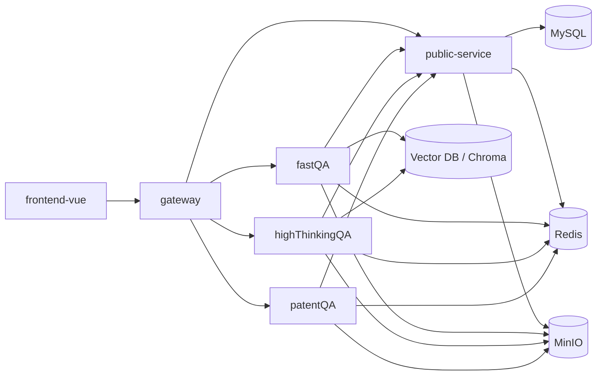
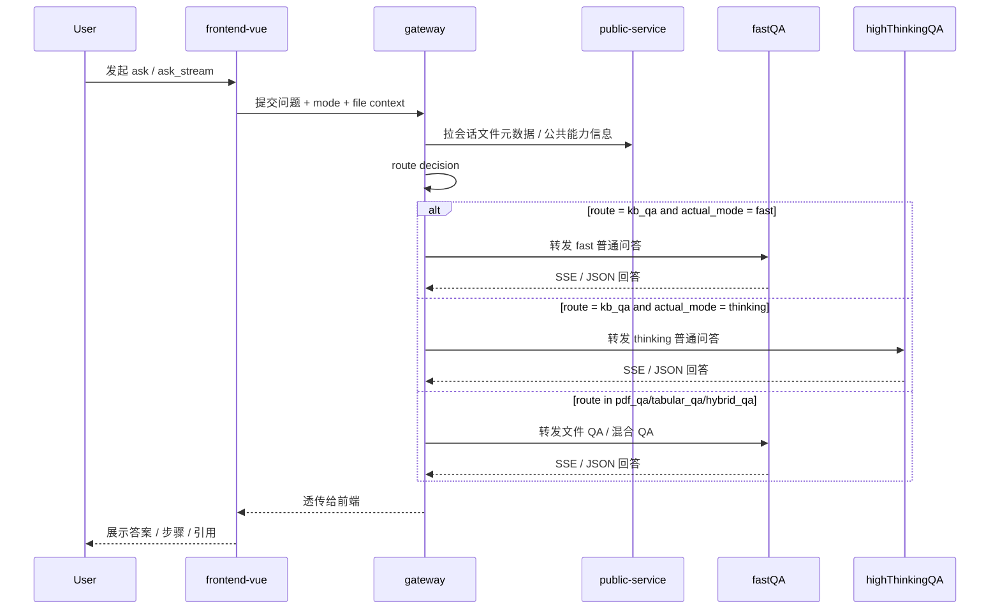
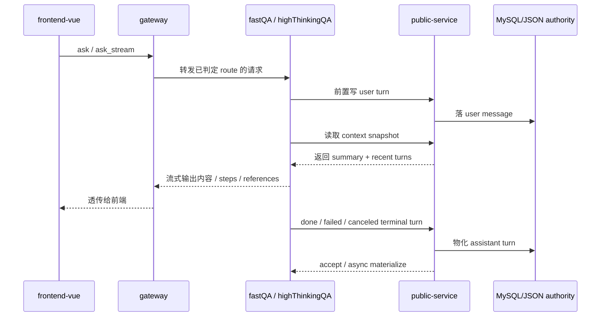
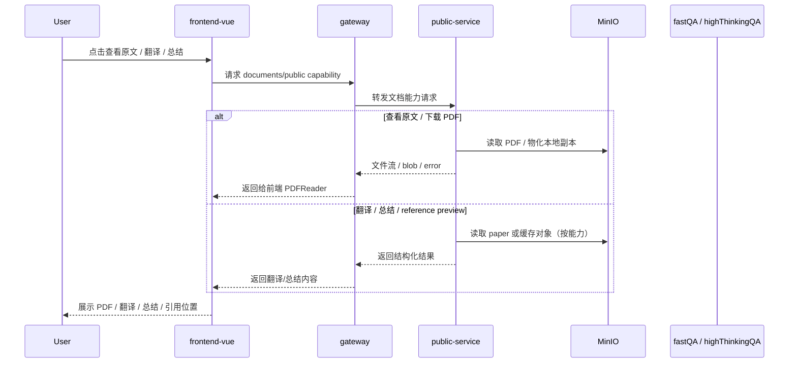
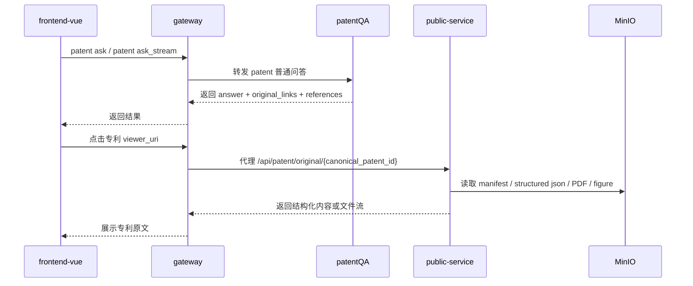

# 阶段工作汇报稿（基于仓库首个提交至当前）

## 说明

这份稿子按当前仓库从首个提交到最新提交的时间线整理，只写已经做过的工作，并把已经形成的系统架构和业务流转一并补进来，便于做阶段汇报。

整理依据有三类：

1. Git 提交记录
2. 当前 `docs/` 下已经沉淀的设计、审计、计划和验证文档
3. 当前已经形成的服务边界与实际运行链路

其中，早期少数提交在仓库里没有对应专题文档，我在稿子里按提交主题做了保守归纳；后续大部分阶段都有文档可对照。

---

## 汇报稿正文

这段时间，我们这套系统的工作，整体上是沿着“从单体式问答后端，逐步走向 `gateway + public-service + fastQA + highThinkingQA + frontend-vue` 的多服务体系”在推进。

如果先从全局架构上看，目前已经完成的最大工作，不是单个 bug 修复，而是把整套系统拆成了职责更清楚的几层：

1. `frontend-vue`
   - 作为统一前端入口
   - 承载会话、问答、文件上传、原文查看、翻译、总结、管理员和配额等页面

2. `gateway`
   - 作为统一 BFF / ingress
   - 负责接前端请求、鉴权透传、文件上下文解析、路由决策、代理转发
   - 尤其负责把 QA 请求按 `mode + route + file context` 分发到对应后端

3. `public-service`
   - 承接公共能力
   - 包括认证、会话、文件元数据、上传、文档、配额、管理员、系统接口
   - 同时逐步成为聊天持久化 authority 和 quota authority

4. `fastQA`
   - 承接 fast 模式普通 QA
   - 承接 PDF QA、表格 QA、混合 QA
   - 承接大部分文件问答执行链

5. `highThinkingQA`
   - 承接 thinking 模式普通 QA
   - 不再作为文件 QA owner
   - 正在向 authority-first 的会话持久化与上下文装配方式收口

6. `patentQA`
   - 已经进入独立支线
   - 当前先做 `mode=patent` 下的普通专利问答
   - 原文查看正在向 `public-service + MinIO + gateway` 体系对齐

也就是说，这段时间最大的工作成果之一，是把“原来耦合在一起的一套系统”，逐步整理成了“统一前端 + 统一 gateway + 公共服务 + 不同 QA 执行器”的架构。

---

## 当前系统整体架构图

这张图对应到当前已经做过的工作，可以概括成一句话：

- 前端不再直接对接多个后端；
- `gateway` 统一接入；
- `public-service` 统一承接公共业务；
- 各 QA 后端只负责自己的问答执行主链；
- Redis / MinIO / 向量库逐步从“本地服务私有依赖”转向“多服务可协作的共享基础设施”。

---

## QA 请求链路架构图

当前普通 QA、文件 QA、混合 QA 的请求已经不是“前端自己决定打谁”，而是先经过 `gateway` 统一做 route decision。

这条链路背后，最近已经完成的工作主要有：

1. 建立 `gateway` 统一 ask 入口
2. 明确 `mode` 和 `route` 的两层语义
3. 把文件问答和混合问答从 `highThinkingQA` 里分离出来，收敛到 `fastQA`
4. 把 `gateway` 变成真正的路由中心，而不是各后端自己各算一遍文件意图

这部分对应的核心文档，是：

- [multi mode gateway architecture](/home/cqy/worktrees/highThinking/docs/multi_mode_gateway_architecture.md)
- [gateway qa routing design](/home/cqy/worktrees/highThinking/docs/superpowers/specs/2026-03-30-gateway-qa-routing-design.md)
- [gateway qa routing implementation](/home/cqy/worktrees/highThinking/docs/superpowers/plans/2026-03-30-gateway-qa-routing-implementation.md)

如果按时间线来看，第一阶段，先做的是基础仓库和问答主链的起步工作。

最早在 3 月 15 日，仓库先完成了前端基础初始化，也就是 `feat: initialize fastapi frontend repository`。  
在这个基础上，3 月 17 日开始补多轮 thinking 问答能力，也修了 bot role 在 ask 请求前的归一化问题。这一阶段的核心，是把最基础的问答框架先搭起来。

到了 3 月 21 日，工作重点开始放到 `fastQA` 普通问答链路对齐上。  
这一阶段先后做了：

1. `fastQA` 普通 QA pipeline 对齐
2. 普通 QA 中 DOI 修复
3. 流式结束后 markdown 渲染恢复
4. 聊天记录状态和会话持久化稳定化
5. `gateway` 和 `public-service` 时间统一到北京时间

这部分虽然当时还没形成现在这么完整的专题文档，但后面不少文档都在继续承接这条线，比如：

- [legacy fastapi normal qa pipeline](/home/cqy/worktrees/highThinking/docs/legacy_fastapi_normal_qa_pipeline.md)
- [fastqa normal qa gap analysis](/home/cqy/worktrees/highThinking/docs/fastqa_normal_qa_gap_analysis.md)
- [fastqa normal qa remediation tasks](/home/cqy/worktrees/highThinking/docs/fastqa_normal_qa_remediation_tasks.md)

紧接着，同一天又开始了架构层的重要变化：把 `gateway` 和 `public-service` 这套新体系引入进来，同时把 `fastQA` 和 `highThinkingQA` 两个独立服务形态拉起来。  
对应提交分别是：

- `feat: add gateway and public-service stack with root frontend`
- `feat: add in-progress fastqa and highthinkingqa services`

这部分在后续文档里有比较系统的沉淀，比如：

- [multi mode gateway architecture](/home/cqy/worktrees/highThinking/docs/multi_mode_gateway_architecture.md)
- [multi mode api contract](/home/cqy/worktrees/highThinking/docs/multi_mode_api_contract.md)
- [three service integration status](/home/cqy/worktrees/highThinking/docs/three_service_integration_status.md)

到了 3 月 22 日，系统开始进入“文件 QA、混合 QA、会话 authority、存储和缓存”这些更核心的问题。  
这一阶段先做了文件路由和混合问答链路增强，也开始系统化审计整个系统的聊天持久化、向量块、highThinking 对齐度和缓存机会。  
对应文档包括：

- [file hybrid qa review](/home/cqy/worktrees/highThinking/docs/file_hybrid_qa_review_zh.md)
- [file hybrid qa coverage](/home/cqy/worktrees/highThinking/docs/file_hybrid_qa_coverage_zh.md)
- [chat persistence and redis audit](/home/cqy/worktrees/highThinking/docs/audit/2026-03-22-chat-persistence-and-redis-audit.md)
- [vector db chunk audit](/home/cqy/worktrees/highThinking/docs/audit/2026-03-22-vector-db-chunk-audit.md)
- [highthinking parity audit](/home/cqy/worktrees/highThinking/docs/audit/2026-03-22-highthinking-parity-audit.md)
- [system audit master](/home/cqy/worktrees/highThinking/docs/audit/2026-03-22-system-audit-master.md)

同样是在 3 月 22 日，开始正式定义“会话 authority 迁移”的架构方向，也就是把聊天记录的权威存储逐步收口到 `public-service`。  
这条线对应的核心文档是：

- [conversation authority migration design](/home/cqy/worktrees/highThinking/docs/superpowers/specs/2026-03-22-conversation-authority-migration-design.md)
- [conversation authority migration plan](/home/cqy/worktrees/highThinking/docs/superpowers/plans/2026-03-22-conversation-authority-migration.md)

---

## QA 持久化链路架构图

这段时间另一条非常关键的工作，是把“问答执行”和“会话权威存储”分开。

现在的目标架构已经明确成下面这条链：

这条链路体现出来的几项重要工作是：

1. user turn 先写 authority，再开始执行问答
2. 问答上下文快照统一从 `public-service` 读取
3. assistant 结果不再只在本地服务里结束，而是回写 authority
4. 失败问答和取消问答也开始成为正式 assistant terminal turn

也就是说，最近这轮工作不是简单“把聊天记录多存一份”，而是在把整个会话模型从“各 QA 服务各自存”逐步迁到“`public-service` 统一存”。

接着到 3 月 23 日，开始把这条 authority 路线真正落到代码上。  
这一阶段先做了 `fastQA` 聊天持久化迁移到 `public-service`，同时把 DOI 后处理导致 markdown 退化的问题继续修补，还把旧 root `highThinking` 后端归档掉，开始收敛目录结构。  

同一天，围绕 `highThinkingQA` 持久化迁移，也形成了专门的审阅和 spec，包括：

- [highThinkingQA persistence review](/home/cqy/worktrees/highThinking/docs/superpowers/specs/2026-03-23-highthinkingqa-persistence-review.md)
- [highThinkingQA persistence migration spec](/home/cqy/worktrees/highThinking/docs/superpowers/specs/2026-03-23-highthinkingqa-persistence-migration-spec.md)
- [highThinkingQA authority migration plan](/home/cqy/worktrees/highThinking/docs/superpowers/plans/2026-03-23-highthinkingqa-authority-migration.md)

3 月 24 日开始，工作进入一个更系统化的阶段。  
这一阶段的特点是，不再只做零散 patch，而是开始把“上下文架构、阶段缓存、服务边界、运行时脚本”这些事情制度化。

这一阶段已经完成的工作包括：

1. 修复流式输出结束后 markdown 仍可能退化的问题
2. 把 `highThinkingQA` 的持久化继续往 `public-service` 迁
3. 给 thinking 的引用检查、验证过程加边界和诊断日志
4. 把所有服务脚本统一切到 `nohup` 生命周期方案
5. 引入 QA 各阶段缓存
6. 开始让 QA 多轮上下文真正贯穿到主链

对应文档有：

- [qa context architecture design](/home/cqy/worktrees/highThinking/docs/superpowers/specs/2026-03-24-qa-context-architecture-design.md)
- [qa context implementation](/home/cqy/worktrees/highThinking/docs/superpowers/plans/2026-03-24-qa-context-architecture-implementation.md)
- [qa stage cache design](/home/cqy/worktrees/highThinking/docs/superpowers/specs/2026-03-24-qa-stage-cache-design.md)
- [qa stage cache implementation](/home/cqy/worktrees/highThinking/docs/superpowers/plans/2026-03-24-qa-stage-cache-implementation.md)
- [context architecture comparison](/home/cqy/worktrees/highThinking/docs/audit/2026-03-24-context-architecture-comparison.md)
- [mixed conversation and storage audit](/home/cqy/worktrees/highThinking/docs/audit/2026-03-24-mixed-conversation-and-storage-audit.md)
- [qa context principles and llama file chat](/home/cqy/worktrees/highThinking/docs/audit/2026-03-24-qa-context-principles-and-llama-file-chat.md)

到 3 月 25 日，主线进一步从“架构搭起来”进入到“细节对齐和用户体验修复”。  
这一天完成的工作非常多，主要集中在：

1. 表格问答 summary 上下文增强
2. `gateway` 文件提示与文件上下文规则调整
3. `fastQA` DOI 和引用链接边界对齐
4. `highThinkingQA` DOI 工具模块隔离
5. `kb_qa` 上下文继续向主回答链注入
6. `fastQA` PDF 物化改走 storage service
7. P2、P3 这类存储、authority、运行时边界继续收口
8. 同时完成了大量审计和路线图文档

对应的文档群包括：

- [alignment priority roadmap](/home/cqy/worktrees/highThinking/docs/audit/2026-03-25-alignment-priority-roadmap.md)
- [tabular summary current state](/home/cqy/worktrees/highThinking/docs/audit/2026-03-25-tabular-summary-current-state.md)
- [tabular summary context improvement spec](/home/cqy/worktrees/highThinking/docs/audit/2026-03-25-tabular-summary-context-improvement-spec.md)
- [fastqa doi normalization boundary design](/home/cqy/worktrees/highThinking/docs/superpowers/specs/2026-03-25-fastqa-doi-normalization-boundary-design.md)
- [fastqa reference link boundary design](/home/cqy/worktrees/highThinking/docs/superpowers/specs/2026-03-25-fastqa-reference-link-boundary-design.md)
- [highthinking doi normalization boundary design](/home/cqy/worktrees/highThinking/docs/superpowers/specs/2026-03-25-highthinking-doi-normalization-boundary-design.md)
- [translation selection paste spec](/home/cqy/worktrees/highThinking/docs/audit/2026-03-25-p4-translation-selection-paste-spec.md)
- [answer summary spec](/home/cqy/worktrees/highThinking/docs/audit/2026-03-25-p4-answer-summary-spec.md)
- [citation evidence positioning spec](/home/cqy/worktrees/highThinking/docs/audit/2026-03-25-p4-citation-evidence-positioning-spec.md)

另外，这个阶段还有一个很重要但容易被忽略的点，就是开始系统梳理“哪些资源优先走 MinIO、哪些只是本地副本、哪些仍然是本地优先”，为后续多实例和容器化部署打基础。  
这部分对应的是：

- [MinIO priority file storage review](/home/cqy/worktrees/highThinking/docs/minio_priority_file_storage_review.md)

到了 3 月 26 日，系统层工作开始进一步向两个方向展开。

第一个方向，是把 `gateway`、authority 和 checker 相关运行时边界做进一步收口，并新增答案总结 contract。  
第二个方向，是把 `patentQA` 这条并行支线正式拉起来，完成了 Phase 1 scaffold。  

这部分的文档包括：

- [qa module integration guide](/home/cqy/worktrees/highThinking/docs/2026-03-26-qa-module-integration-guide.md)
- [reference object contract audit](/home/cqy/worktrees/highThinking/docs/audit/2026-03-26-reference-object-contract-audit.md)
- [highthinkingqa latency diagnosis](/home/cqy/worktrees/highThinking/docs/audit/2026-03-26-highthinkingqa-latency-diagnosis.md)
- [p3 runtime boundary notes](/home/cqy/worktrees/highThinking/docs/audit/2026-03-26-p3-runtime-boundary-notes.md)

3 月 27 日和 28 日，主线进入“产品能力和可运营能力”阶段。  
这一阶段已经做过的工作包括：

1. 修复 `highThinking` summary 持久化和选中文件问答路由
2. 修复文件 QA 重路由后的持久化和公式渲染问题
3. 加固 DOI 解析
4. 增加管理员批量用户操作
5. 补充 Docker 部署打包
6. 开始把引用元数据在服务之间持久化
7. 优化引用展示和 ask payload 透传
8. 默认开启 fast answer summary
9. 明确 gateway forwarding admission 行为
10. 建立统一配额管理模型

这阶段最关键的文档，是配额、Redis/MQ 和管理员能力这几条线：

- [quota management design](/home/cqy/worktrees/highThinking/docs/superpowers/specs/2026-03-28-quota-management-design.md)
- [quota management rollout](/home/cqy/worktrees/highThinking/docs/superpowers/plans/2026-03-28-quota-management-rollout.md)
- [admin batch ops plan](/home/cqy/worktrees/highThinking/docs/superpowers/plans/2026-03-28-admin-batch-ops.md)
- [interactive admission decisions](/home/cqy/worktrees/highThinking/docs/superpowers/specs/2026-03-27-interactive-admission-kickoff-decisions.md)
- [redis mq architecture spec](/home/cqy/worktrees/highThinking/docs/2026-03-25-redis-mq-architecture-spec.md)
- [redis mq rollout](/home/cqy/worktrees/highThinking/docs/superpowers/plans/2026-03-25-redis-mq-rollout.md)
- [docker deployment guide](/home/cqy/worktrees/highThinking/docs/2026-03-25-docker-deployment-guide.md)

进入 3 月 30 日和 31 日之后，工作重点变成三块：

第一块，是把 `gateway` QA 路由体系彻底制度化。  
这一块明确了：

1. `mode` 与 `route` 的职责分离
2. 文件 QA、表格 QA、混合 QA 的统一路由规则
3. 文件存在不等于本轮必须用文件
4. 文件问答和混合问答统一由 `fastQA` 承接

对应文档是：

- [gateway qa routing design](/home/cqy/worktrees/highThinking/docs/superpowers/specs/2026-03-30-gateway-qa-routing-design.md)
- [gateway qa routing implementation](/home/cqy/worktrees/highThinking/docs/superpowers/plans/2026-03-30-gateway-qa-routing-implementation.md)

第二块，是把前端长会话卡顿问题系统化处理。  
这里不是简单调几个参数，而是明确定位为：

1. 长会话整段消息重渲染
2. 右侧大纲全量扫描
3. 流式目标消息重复定位
4. 自动滚动和本地持久化在长会话里的累积成本

对应文档是：

- [frontend long conversation performance design](/home/cqy/worktrees/highThinking/docs/superpowers/specs/2026-03-31-frontend-long-conversation-performance-design.md)
- [frontend long conversation performance verification](/home/cqy/worktrees/highThinking/docs/superpowers/implementation/2026-03-31-frontend-long-conversation-performance-verification.md)

第三块，是把“失败问答也要成为正式聊天记录”这件事彻底做实。  
也就是不再只保留成功问答，而是把 failed / canceled 也纳入会话 authority 模型。  
这条线对应的是：

- [qa failed turn persistence design](/home/cqy/worktrees/highThinking/docs/superpowers/specs/2026-03-30-qa-failed-turn-persistence-design.md)
- [qa failed turn persistence rollout](/home/cqy/worktrees/highThinking/docs/superpowers/plans/2026-03-31-qa-failed-turn-persistence-rollout.md)
- [qa failed turn persistence verification](/home/cqy/worktrees/highThinking/docs/superpowers/implementation/2026-03-31-qa-failed-turn-persistence-verification.md)

而且这条线已经不只是设计，最新提交 `d00e7aa feat: persist failed qa terminal turns` 已经把这件事真正做进代码、测试和前端恢复逻辑里了。

同样在 3 月 31 日，前端 quota 受限提示也做了统一化，针对聊天页和文献辅助都开始用统一的额度受限表达。  
对应文档是：

- [quota limit feedback design](/home/cqy/worktrees/highThinking/docs/superpowers/specs/2026-03-31-quota-limit-feedback-design.md)
- [quota limit feedback rollout](/home/cqy/worktrees/highThinking/docs/superpowers/plans/2026-03-31-quota-limit-feedback-rollout.md)

同时，专利支线也在 3 月 31 日进入更实质的阶段。  
这一天不仅做了 `patent original store core`、`patent original view routes`，还把专利原文查看开始通过 `public-service` 和 `gateway` 体系对接起来。  
这部分对应的文档有：

- [patentqa delivery spec](/home/cqy/worktrees/highThinking/docs/2026-03-30-patentqa-delivery-spec.md)
- [patent original view minio public-service spec](/home/cqy/worktrees/highThinking/docs/2026-03-31-patent-original-view-minio-public-service-spec.md)
- [patent original view implementation plan](/home/cqy/worktrees/highThinking/docs/2026-03-31-patent-original-view-implementation-plan.md)
- [patentqa implementation task breakdown](/home/cqy/worktrees/highThinking/docs/2026-03-31-patentqa-implementation-task-breakdown.md)
- [patentqa vector retrieval task breakdown](/home/cqy/worktrees/highThinking/docs/2026-03-31-patentqa-vector-retrieval-task-breakdown.md)

---

## 查看原文 / 文档辅助链路架构图

除了问答主链，这段时间另一个重要成果，是把“查看原文、翻译、总结、文档辅助”这些能力，从“零散挂在后端各处”，逐步收口成更清晰的公共文档链路。

当前已经形成的公共文档链路，可以概括成下面这样：

这条链上，最近做过的工作主要包括：

1. 把 `PdfReader`、翻译、总结这些能力更多地收口到公共 documents 链路
2. 让 quota 受限提示在文档辅助链路里也能统一展示
3. 明确 `MinIO` 在 papers、上传文件、原文查看这些场景下的优先级和职责

这部分对应的文档包括：

- [quota limit feedback design](/home/cqy/worktrees/highThinking/docs/superpowers/specs/2026-03-31-quota-limit-feedback-design.md)
- [quota limit feedback rollout](/home/cqy/worktrees/highThinking/docs/superpowers/plans/2026-03-31-quota-limit-feedback-rollout.md)
- [MinIO priority file storage review](/home/cqy/worktrees/highThinking/docs/minio_priority_file_storage_review.md)

---

## Patent 原文查看链路架构图

专利支线这段时间做的，不只是问答骨架，还包括把“查看原文”这件事从 `patentQA` 本地处理，逐步设计成统一的公共查看链路。

当前目标架构是：

这里已经做过的工作是：

1. 明确了 `patentQA` 负责原文定位语义，不直接负责前端原文流回传
2. 明确了 `public-service` 负责专利原文实际 HTTP 服务
3. 明确了 `gateway` 继续作为统一入口代理原文查看
4. 开始把专利原文资源和 `MinIO` 存储模型对齐

这部分对应文档主要是：

- [patentqa gateway/public-service protocol](/home/cqy/worktrees/highThinking/docs/2026-03-24-patentqa-gateway-public-service-protocol.md)
- [patent original view minio/public-service spec](/home/cqy/worktrees/highThinking/docs/2026-03-31-patent-original-view-minio-public-service-spec.md)
- [patent original view implementation plan](/home/cqy/worktrees/highThinking/docs/2026-03-31-patent-original-view-implementation-plan.md)

最后到了 4 月 1 日，在继续修复失败问答持久化这条线的同时，又补上了新的用户体验设计：  
也就是在 PDF Reader 里，把“复制一段原文再手动粘贴翻译”这件事，设计成后续支持“粘贴并翻译”的交互。  
这部分目前已经完成 spec 和 implementation plan：

- [pdf reader clipboard translate design](/home/cqy/worktrees/highThinking/docs/superpowers/specs/2026-04-01-pdf-reader-clipboard-translate-design.md)
- [pdf reader clipboard translate plan](/home/cqy/worktrees/highThinking/docs/superpowers/plans/2026-04-01-pdf-reader-clipboard-translate-plan.md)

如果把这段时间的工作总结成一句话，那就是：

我们已经把这套系统，从最初的前后端基础仓库，逐步推进成一个以 `gateway` 负责统一入口、`public-service` 负责 authority 和公共能力、`fastQA` 和 `highThinkingQA` 分别承接不同问答链路、前端围绕真实用户体验持续修补的多服务问答系统；同时，专利 `patentQA` 这条并行支线，也已经从纯规划进入到具备服务骨架和原文查看链路落地的阶段。

---

## 可直接附在汇报后面的代表性文档

如果汇报时需要附“本阶段文档依据”，建议优先挂这几份：

1. [conversation authority migration design](/home/cqy/worktrees/highThinking/docs/superpowers/specs/2026-03-22-conversation-authority-migration-design.md)
2. [qa context architecture design](/home/cqy/worktrees/highThinking/docs/superpowers/specs/2026-03-24-qa-context-architecture-design.md)
3. [qa stage cache design](/home/cqy/worktrees/highThinking/docs/superpowers/specs/2026-03-24-qa-stage-cache-design.md)
4. [quota management design](/home/cqy/worktrees/highThinking/docs/superpowers/specs/2026-03-28-quota-management-design.md)
5. [gateway qa routing design](/home/cqy/worktrees/highThinking/docs/superpowers/specs/2026-03-30-gateway-qa-routing-design.md)
6. [frontend long conversation performance design](/home/cqy/worktrees/highThinking/docs/superpowers/specs/2026-03-31-frontend-long-conversation-performance-design.md)
7. [qa failed turn persistence verification](/home/cqy/worktrees/highThinking/docs/superpowers/implementation/2026-03-31-qa-failed-turn-persistence-verification.md)
8. [patentqa delivery spec](/home/cqy/worktrees/highThinking/docs/2026-03-30-patentqa-delivery-spec.md)

---

## 附录：按提交记录拆解的工作明细

这一节按提交顺序，把每个 commit 做的事情再细化一层，方便汇报时按版本演进去讲。

### 2026-03-15

#### `9129e90 feat: initialize fastapi frontend repository`

做了这些事情：

1. 初始化了最早的完整前后端仓库骨架。
2. 建立了早期 `agent_core` 问答主链，包括：
   - `checker`
   - `decomposer`
   - `direct_answerer`
   - `graph`
   - `synthesizer`
   - `reviser`
3. 建立了最早的前端工程，包括：
   - 登录
   - 会话
   - PDFReader
   - 管理端
   - 配额页
4. 形成了最早的配置、环境变量、LLM 调用和文献阅读器基础设施。

### 2026-03-17

#### `878be59 feat: add multiturn thinking pipeline support`

做了这些事情：

1. 在旧 `highThinking` 体系里增强了多轮 thinking 问答链路。
2. 增加了：
   - 查询改写
   - 会话上下文服务
   - 会话摘要服务
   - 多轮对话测试
3. 同时写入了较早的多模式架构文档：
   - `multi_mode_api_contract`
   - `multi_mode_gateway_architecture`
   - `multi_mode_gateway_task_breakdown`

#### `ad4cd71 fix: normalize bot role before ask requests`

做了这些事情：

1. 修复了前端 ask 请求前 bot role 归一化问题。
2. 避免前端消息角色和后端协议不一致导致的问答异常。

### 2026-03-21

#### `6b0e111 feat: align fastqa normal qa pipeline`

做了这些事情：

1. 正式引入 `fastQA` 独立服务骨架。
2. 把普通 QA 主链迁成独立模块，包括：
   - runtime
   - llm integration
   - redis integration
   - documents module
   - file context parser
3. 同时补了普通 QA 差距分析、迁移清单和旧版 pipeline 文档。

#### `a240f3e fix: align fastqa normal qa doi repair`

做了这些事情：

1. 对 `fastQA` 的 DOI 插入和修复逻辑做了第一轮对齐。
2. 修改了：
   - `context_loading`
   - `doi_inserter`
   - `pdf_pipeline`
   - `retrieval_validation`
   - `stage2_retrieval`
   - `synthesis_postprocess`
3. 补齐了对应的 DOI 与 stage4 测试。

#### `870890e fix: restore markdown rendering after stream completion`

做了这些事情：

1. 修复流式问答结束后 markdown 渲染退化问题。
2. 重点修改了前端样式和 markdown 渲染工具逻辑。

#### `a64bea7 fix: stabilize chat history state and conversation persistence`

做了这些事情：

1. 修复聊天记录状态混乱与刷新后不稳定的问题。
2. 重点增强了：
   - 前端 `chatStore`
   - 前端 `Home.vue`
   - `public-service` conversation cache / repository / service
3. 建立了聊天记录修复计划文档。

#### `082b88c fix: unify gateway and public-service timestamps to beijing time`

做了这些事情：

1. 统一了 `gateway` 和 `public-service` 的时间到北京时间语义。
2. 补了 timezone/runtime 相关能力和测试。
3. 修正了会话列表、系统时间展示、落库时间一致性问题。

#### `4bf91f5 feat: add gateway and public-service stack with root frontend`

做了这些事情：

1. 把 `gateway` 和 `public-service` 正式引入当前仓库结构。
2. 开始把前端从“直连单体后端”切向“统一入口 + 公共服务”模式。
3. 建立了 monorepo 下 `gateway/public-service` 的导入规格和独立服务评估文档。

#### `aebe4c4 feat: add in-progress fastqa and highthinkingqa services`

做了这些事情：

1. 把 `fastQA` 和 `highThinkingQA` 作为两个独立服务目录落地。
2. 写入了：
   - `fastQA` 迁移清单
   - `highThinkingQA` 迁移清单
   - `fastQA` source mapping
   - gateway 对齐 spec
3. 把原始 `highThinking` 问答链路复制并整理进新服务目录。

### 2026-03-22

#### `5d2aad9 feat: improve qa file routing and hybrid flows`

做了这些事情：

1. 增强 `fastQA` 的文件 QA、表格 QA、混合 QA 路由与执行能力。
2. 新增上传文件物化层和 `storage_ref/local_path` 协作逻辑。
3. 增强 `request_adapter`、`stream_contract`、文件路由、tabular 服务等模块。
4. 前端开始引入统一文件选择工具和多文件选择逻辑。
5. `gateway` 的 `file_context_resolver` 和 `route_decision` 开始增强。

### 2026-03-23

#### `d560068 feat: migrate conversation persistence to public-service`

做了这些事情：

1. 把 `fastQA` 的聊天持久化主链迁到 `public-service`。
2. 引入：
   - authority client
   - pending overlay
   - authority schemas / internal api
   - assistant inbox
3. 把 `public-service` conversation authority 真正往中心位置推了一步。
4. 同时为 `highThinkingQA` 预留了相关配置项。

#### `ed584da fix: preserve markdown during doi postprocess`

做了这些事情：

1. 修复 DOI 后处理阶段把 markdown 结构破坏的问题。
2. 主要修改 DOI inserter 和 reference alignment。

#### `24929f5 chore: archive legacy root highThinking backend`

做了这些事情：

1. 把旧 root `highThinking` 后端整体归档到 `archive/`。
2. 明确新工作区以独立 `highThinkingQA` 目录为准。

### 2026-03-24

#### `9bcdb94 fix: preserve markdown rendering after streaming`

做了这些事情：

1. 再次修复前端流式结束后 markdown 渲染丢失问题。
2. 给 markdown 渲染逻辑补了测试。

#### `e19a2a5 feat: migrate thinking persistence to public-service`

做了这些事情：

1. 把 `highThinkingQA` 的普通 QA 聊天持久化开始迁往 `public-service`。
2. 新增：
   - `highThinkingQA` authority client
   - `chat_persistence`
   - context snapshot 读取适配
3. 调整 `gateway` thinking 路径的代理持久化逻辑。
4. 补齐 `highThinkingQA` 相关测试和 `public-service` authority integration 测试。

#### `62c0e49 fix: bound thinking verification and add diagnostics`

做了这些事情：

1. 给 `highThinkingQA` 引用检查、reviser、llm client、vector retrieval 等链路加了边界控制。
2. 补了大量诊断日志和测试。
3. 开始针对 checker / reviser 的慢和卡问题做技术治理。

#### `4d750a6 chore: switch backend services to nohup lifecycle`

做了这些事情：

1. 把 `fastQA / gateway / highThinkingQA / public-service` 的启停脚本统一到 `nohup` 方案。
2. 对齐了：
   - start
   - stop
   - status
3. 补了生命周期脚本测试。

#### `4181a88 docs: add migration audits and architecture notes`

做了这些事情：

1. 增加首轮迁移审计文档和架构说明。
2. 为后续 authority、缓存、上下文、mixed conversation 等工作提供文档基线。

#### `7d5d683 feat: add QA stage caches across services`

做了这些事情：

1. 给 QA 各阶段引入缓存能力。
2. `fastQA` 和 `highThinkingQA` 都开始形成 stage cache 体系。

#### `3e6ece6 docs: add QA cache and mixed conversation audits`

做了这些事情：

1. 补了 QA cache 审计。
2. 补了 mixed conversation 和上下文边界相关文档。

#### `31b9a6d feat: align qa conversation context across services`

做了这些事情：

1. 开始把 QA 多轮上下文在服务间对齐。
2. 重点让会话历史和 summary 不再只是“读到”，而是开始更系统地进入 ask 主链。

### 2026-03-25

#### `59c4af8 feat: align tabular summary context and gateway file hints`

做了这些事情：

1. 增强表格 QA summary 的上下文质量。
2. 优化 `gateway` 文件 hint 传递和表格链路识别。

#### `0052dad refactor: trim highthinking route surface`

做了这些事情：

1. 开始收缩 `highThinkingQA` 与其目标职责不一致的路由面。
2. 为后续让它只专注普通 thinking QA 做准备。

#### `c49b00f fix: align fastqa doi and reference link boundaries`

做了这些事情：

1. 对齐 `fastQA` 的 DOI、reference link、pdf link 边界。
2. 让引用链路和前端 viewer 语义更稳定。

#### `66b063a refactor: isolate hthinking doi utilities`

做了这些事情：

1. 把 `highThinkingQA` 的 DOI 工具做隔离。
2. 降低 DOI 处理和 ask 主链的耦合。

#### `8f2a1d0 docs: add alignment and qa audit notes`

做了这些事情：

1. 新增一批 QA 对齐审计和阶段性记录。
2. 把“剩余未对齐项”继续文档化。

#### `c05a4fc fix: close p0 protocol and tabular alignment gaps`

做了这些事情：

1. 收掉一批 P0 级协议和表格 QA 对齐差口。
2. 主要是用户可见行为和 route contract 的修复。

#### `0c83435 feat: thread kb qa context into stage4 synthesis`

做了这些事情：

1. 把 `kb_qa` 上下文真正注入 `fastQA` stage4 synthesis。
2. 让多轮上下文不只停留在 rewrite，而是进入最终回答阶段。

#### `b7f6b4e fix: tighten authority boundary and log fastqa stage4 context`

做了这些事情：

1. 收紧 authority 边界。
2. 给 `fastQA` stage4 上下文注入和验证过程补详细日志。

#### `4a6da6c docs: extend alignment roadmap follow-up items`

做了这些事情：

1. 扩展路线图文档。
2. 把后续优先级和继续推进事项固定下来。

#### `1dc30e0 refactor: route fastqa pdf materialization via storage service`

做了这些事情：

1. 把 `fastQA` 的 PDF 文件物化流程往 storage service 收口。
2. 减少文件执行对散乱本地路径的直接依赖。

#### `102882f refactor: complete p2 storage and context boundary alignment`

做了这些事情：

1. 继续收 storage 和 context 的边界。
2. 为 MinIO 优先、authority-first、多服务一致性做准备。

### 2026-03-26

#### `71ad876 refactor: align p3 cache and authority runtime boundaries`

做了这些事情：

1. 收口 P3 级 cache 与 authority runtime 边界。
2. 简化 `gateway` 中不该承担的 cache/runtime 逻辑。
3. 补了 TTL contract 和 runtime boundary 文档。

#### `302b68b refactor: slice highthinking checker verification`

做了这些事情：

1. 重构 `highThinkingQA` checker 验证逻辑。
2. 把 precheck / verify 逻辑切得更细，便于调优和测试。

#### `88bac5e feat: finish p3 gateway authority and checker alignment`

做了这些事情：

1. 收掉一批 P3 级 gateway authority 和 checker 对齐问题。
2. 调整 frontend、gateway、authority schema 之间的细节接口。

#### `318116b feat: add answer summary contract`

做了这些事情：

1. 建立了答案 summary contract。
2. `fastQA` 和 `highThinkingQA` 都开始有独立 answer summary 模块。
3. 补了 answer summary 的审计、spec 和 rollout 计划。

#### `f585cd4 feat: add patent phase1 service scaffold`

做了这些事情：

1. 正式建立 `patentQA` Phase 1 独立服务骨架。
2. 包含：
   - ask / ask_stream
   - health
   - authority client
   - chat persistence
   - execution cache
   - redis runtime
   - mode profiles
3. 补齐了大批 contract 测试和 Phase 1 设计文档。

### 2026-03-27

#### `b6c0cae fix: persist highThinking summaries and route selected file queries`

做了这些事情：

1. 修复 `highThinkingQA` summary 持久化。
2. 修正 selected file queries 在 route 层的处理。

#### `fff11f3 fix: support rerouted file qa persistence and math rendering`

做了这些事情：

1. 支持 thinking/file 请求被 reroute 到 `fastQA` 后的持久化闭环。
2. 修复数学公式/上标下标在前端的渲染问题。
3. 补了 authority API 和 integration 测试。

#### `b8bfb26 fix: harden doi parsing across qa pipelines`

做了这些事情：

1. 给多条 QA pipeline 的 DOI 解析做统一加固。
2. 减少假 DOI、脏 DOI、拼接 DOI 对引用和原文查看的污染。

### 2026-03-28

#### `44d6eae feat: add admin batch user operations`

做了这些事情：

1. 给管理员界面补了批量用户操作。
2. 包括：
   - 批量删除
   - 批量切换用户类型
3. 前后端和 gateway public proxy 都补了对应接口与测试。

#### `22e93c3 chore: add docker deployment bundle`

做了这些事情：

1. 补齐容器化部署产物。
2. 包含：
   - docker compose
   - Dockerfile
   - seed data
   - MinIO 初始化脚本
   - MySQL 初始化
   - preflight check
3. 同时写了完整的 Docker 部署指南。

#### `e68d1f2 docs: update qa integration and protocol specs`

做了这些事情：

1. 大规模更新 QA 集成、专利协议、Redis/MQ、translation selection paste、citation positioning 等文档。
2. 把很多已经讨论过但分散的设计正式写入文档体系。

#### `1fe4e5d feat: persist rich citation metadata across services`

做了这些事情：

1. 把 richer citation metadata 开始持久化到跨服务链路中。
2. 让 `fastQA / highThinkingQA / public-service / gateway` 在引用元数据上更一致。

#### `cf7f005 feat: improve citation display and ask payload forwarding`

做了这些事情：

1. 优化前端引用展示。
2. 改进 `PdfReader` 中引用位置和证据展示。
3. 优化 ask payload 在服务间转发时的字段保真。

#### `91f72d3 feat: enable fast answer summary by default`

做了这些事情：

1. 默认开启 `fastQA` 的 answer summary。
2. 让普通快问答也能产出结构化总结能力。

#### `2453414 docs: clarify gateway forwarding admission behavior`

做了这些事情：

1. 明确 gateway forwarding / admission 的文档边界。
2. 为并发控制和 admission worker 留出制度化说明。

### 2026-03-30

#### `a37c61c feat: implement unified quota management`

做了这些事情：

1. 建立统一 quota 模型：
   - `ask_query`
   - `file_qa`
   - `file_view`
   - `doc_assist`
2. 让 `public-service` 成为 quota authority。
3. 新增 `gateway` 的 quota proxy 和 QA 主链 quota 编排。
4. 前端 quota 管理页面和用户可见 quota 类型也做了统一化。

### 2026-03-31

#### `1b35cc9 chore: extend qa cache ttl to 12h`

做了这些事情：

1. 把 QA 阶段缓存 TTL 扩到 12 小时。
2. 同步调整了 `fastQA` 和 `highThinkingQA` 两边的 cache contract。

#### `8850082 feat: refine qa routing and streaming fixes`

做了这些事情：

1. 继续增强 QA route contract、streaming 行为和前端渲染稳定性。
2. 引入：
   - `messageRenderMemo`
   - `routingStatus`
   - `streamingRender`
   - `execution admission`
   - `execution event relay`
3. 让 `gateway` 路由和前端对错误/流式状态的处理更稳。

#### `e10022d fix: harden quota grant lifecycle`

做了这些事情：

1. 加固 quota grant 生命周期。
2. 防止 finalize / release / grant token 状态漂移。

#### `b0b33d6 fix: render doi links inside answer tables`

做了这些事情：

1. 修复答案 markdown 表格里的 DOI 链接渲染问题。
2. 补了对应 markdown 测试。

#### `35abd0c feat: add patent original store core`

做了这些事情：

1. 给 `public-service` 增加专利原文对象存储核心。
2. 新增：
   - `patent_original_store`
   - patent 原文 schema
   - MinIO / local storage helper
3. 增加 fixtures 和 `test_patent_original_view_module`。

#### `611be2c fix(fastqa): harden stage1 parsing and ask input validation`

做了这些事情：

1. 加固 `fastQA` stage1 规划 JSON 解析失败场景。
2. 补 ask 模型和输入校验。
3. 对 `file_hybrid_qa_protocol_spec` 和 `multi_mode_api_contract` 文档做了更新。

#### `7478bf4 fix(frontend): stabilize streaming render and chat persistence`

做了这些事情：

1. 系统治理前端长会话卡顿问题。
2. 新增：
   - `messageWindowing`
   - `questionOutline`
   - `scrollFollow`
   - `streamingTarget`
   - `streamPersistPolicy`
3. 补充大量前端结构测试和性能验证计划文档。

#### `553e539 chore(runtime): align service scripts and planning docs`

做了这些事情：

1. 补齐和整理了一批关键 spec/plan 文档：
   - quota management
   - gateway qa routing
   - failed turn persistence
2. 对齐了顶层服务脚本。
3. 让文档和运行脚本成为这一阶段收口的一部分。

#### `15af574 test(highthinkingqa): cover direct answer fallback timing`

做了这些事情：

1. 给 `highThinkingQA` 的 direct answer fallback 和 stage model selection 补测试。
2. 针对 timing 问题增加覆盖。

#### `b71d965 feat: add patent original view routes`

做了这些事情：

1. 在 `public-service` documents 模块里增加专利原文查看 routes。
2. 补齐 service、cache、documents tests、route surface tests。

#### `bac3631 feat: proxy patent original routes through public backend`

做了这些事情：

1. 在 `gateway` 增加专利原文查看 public proxy。
2. 让专利原文查看开始走 `gateway -> public-service` 代理链。

#### `d3b18ab feat: improve quota limit feedback`

做了这些事情：

1. 把 quota 失败提示统一成结构化前端卡片。
2. 新增：
   - `QuotaLimitCard`
   - `quota-error-formatting`
   - `pdfReaderOpenFlow`
3. 优化聊天页和 `PdfReader` 中 quota 失败反馈的一致性。

### 2026-04-01

#### `d00e7aa feat: persist failed qa terminal turns`

做了这些事情：

1. 把失败问答和取消问答也纳入正式 assistant terminal turn 模型。
2. `public-service` 新增 terminal contract / read model / materialization 支撑。
3. `fastQA` 和 `highThinkingQA` 的 failed/canceled turn 可以落库。
4. 前端刷新后可以恢复显示 failed/canceled 历史消息，而不是消失。
5. 写入了完整的 rollout 和 verification 文档。
