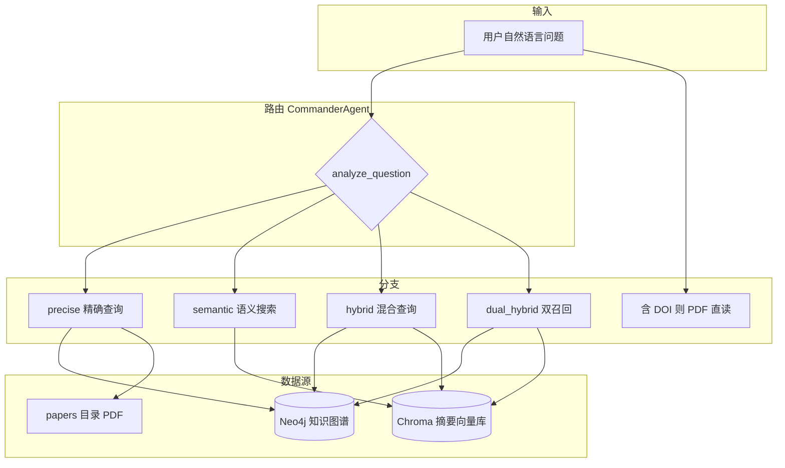

# 知识图谱问答流程说明

本文描述系统中 **以 Neo4j 知识图谱为核心、配合向量库与 PDF 原文** 的经典问答链路，对应 [`main.py`](main.py) 中的 `MaterialScienceAgent`（`smart_query` / `query` / `semantic_search` / `hybrid_query` 等）。

> **与 Web 主对话的关系**：当前 [`web_app.py`](web_app.py) 流式对话在「问题中无 DOI、非上传 PDF」时，**默认优先走「生成驱动检索」**（`GenerationDrivenRAG`，见 [专利问答检索流程.md](./专利问答检索流程.md) 的论文/专利向量 RAG），执行完毕即 `return`，**通常不会执行到**下文所述的 Commander → Neo4j 分支。经典图谱流程仍完整保留在代码中，可通过 **直接调用 `agent.smart_query(...)`**、关闭生成驱动开关（若日后恢复）、或其它非默认入口使用。

---

## 1. 总体架构

- **Neo4j**：结构化材料/性能/文献节点与关系，通过 **Cypher** 做过滤、排序、统计。
- **Chroma（`VECTOR_DB_PATH`）**：文献摘要向量库，由 **`MicroscopicSemanticExpert`** 做语义检索与重排。
- **`papers/`**：按 DOI 命名的 PDF，用于精确查询答案合成阶段的原文增强、以及 **问题内带 DOI** 时的直读。

---

## 2. 统一入口：`smart_query`

实现位置：[`main.py` — `MaterialScienceAgent.smart_query`](main.py)。

**处理顺序概要**：

1. **问题中含标准 DOI**（正则 `10.\d+/...`）  
   - **不走路由**，直接 **`query_pdf_directly`**：从 `PAPERS_DIR` 加载对应 PDF → LLM 基于全文回答。  
   - **数据**：本地 PDF；**不用** Neo4j、**不用** Chroma。

2. **否则** 调用 **`CommanderAgent.analyze_question`**，得到决策字符串：

   | 返回值 | 后续行为 |
   |--------|----------|
   | `hybrid` | 若 `use_dual_retrieval=True` 且语义专家可用 → **`dual_hybrid_query`**；否则 **`hybrid_query`** |
   | `precise` | **`query`**（知识图谱精确查询） |
   | `community` | 社区专家已关闭：等价于 **宽泛语义搜索** `semantic_search(..., force_broad=True)` |
   | 其它（默认语义） | **`semantic_search`**；若语义专家不可用则回退 **`query_hybrid`** |

---

## 3. 决策指挥官：`CommanderAgent.analyze_question`

实现位置：[`commander_agent.py`](commander_agent.py)。

**逻辑要点**（优先级从高到低，与代码一致）：

1. **`HybridQueryAgent.is_hybrid_question`**：同时含「数值/比较类筛选」与「特点/工艺/趋势/对比」等分析需求 → **`hybrid`**。
2. **精确关键词**（如大于、最高、最小、统计等）且命中 **Neo4j 数值类属性关键词**（如压实密度、比容量、粒径等）→ **`precise`**。
3. **社区类关键词**（机制、关系、数据质量等）→ **`community`**（Web 侧会改走宽泛语义）。
4. **语义类关键词**（如何、影响、方法、为什么等）→ **`semantic`**（优先于「仅图谱属性 + 列举」）。
5. **图谱非数值属性** + **列举/过滤语气**（有哪些、哪些、含有等）→ **`precise`**。
6. **仅 Neo4j 数值属性** → **`precise`**。
7. **实体关键词**（如 LFP、LiFePO4、NCM 等）→ **`precise`**。
8. **默认** → **`semantic`**。

宽泛/精确还可由 **`is_broad_question`**（LLM 或规则）在语义分支内影响检索条数与合成策略。

---

## 4. 精确查询（知识图谱主路径）：`query`

实现位置：[`main.py` — `MaterialScienceAgent.query`](main.py)。

**三步流水线**：

| 步骤 | 名称 | 作用 | 依赖 |
|------|------|------|------|
| 1 | `_generate_cypher_query` | 将自然语言转为 **Cypher**（`system_prompt.txt` + LLM） | LLM |
| 2 | `_validate_cypher_query` | 校验含 `MATCH`、禁止 `DELETE`/`CREATE` 等危险写操作 | — |
| 3 | `_execute_cypher_query` | **`self.graph.query(cypher_query)`** 执行查询 | **Neo4j**（`langchain_community.graphs.Neo4jGraph`） |
| 4 | `_synthesize_answer` | 将结构化结果 +（可选）PDF 正文交给 LLM 生成自然语言答案 | LLM、`synthesis_prompt*.txt`、`PAPERS_DIR` |

**Neo4j 连接**：环境变量 `NEO4J_URL`、`NEO4J_USERNAME`、`NEO4J_PASSWORD`（见 `_init_neo4j_connection`）。

**答案合成阶段**：从每条记录的 `doi` 或 `material_name` 中解析 DOI，尝试 **`_load_pdf_by_doi`** 拉取 `papers/{doi转下划线}.pdf` 片段，与图谱结果一并写入合成 Prompt，便于引用原文细节。

**输出**：`final_answer`、`raw_data`、`cypher_query`、`result_count` 等。Web 侧若走此路径，会标记 **`query_mode` ≈ 「知识图谱（精确查询）」**。

---

## 5. 语义搜索：`semantic_search`

实现位置：[`main.py` — `MaterialScienceAgent.semantic_search`](main.py)。

- 使用 **`MicroscopicSemanticExpert`** 对 **`VECTOR_DB_PATH`** 指向的 **Chroma 摘要库** 做向量检索（可翻译、可重排）。
- 根据 **`commander.is_broad_question`** 等决定检索条数（如宽泛 15、否则 10）及是否走「方案五」等宽泛合成流程。
- **不使用 Neo4j**（除非内部另有辅助逻辑，主路径为 Chroma + LLM）。

---

## 6. 混合查询：`hybrid_query` 与 `dual_hybrid_query`

- **`hybrid_query`**（[`main.py`](main.py)）：典型为 **两阶段**——先用 Neo4j/Cypher 做条件筛选，再对结果或子问题做语义分析（具体步骤见 `hybrid_query` 内联日志与 `HybridQueryAgent.decompose_question`）。
- **`dual_hybrid_query`**：  
  - **Path 1**：对分解后的 phase1 问题调 **`query`** → **Neo4j**。  
  - **Path 2**：生成语义 query → **`semantic_search`** → **Chroma**。  
  - **`DualRetrievalAgent`** 融合两路结果 → LLM 综合答案。

**数据**：**Neo4j + Chroma** 同时使用。

---

## 7. 其它相关能力

| 能力 | 说明 |
|------|------|
| **`Neo4jTwoStageOptimizer`** | Agent 初始化时挂载，用于部分场景下对 Neo4j 查询做两阶段优化（见 `main.py` 中优化相关调用）。 |
| **`verify_doi_in_database` / `get_literature_content`**（`web_app.py`） | 可结合 **Neo4j** 校验 DOI、拉文献信息；属辅助 API，非主问答流水线核心。 |
| **社区专家** | 已关闭，原 `community` 路由改为宽泛语义。 |

---

## 8. 环境变量速查

| 变量 | 用途 |
|------|------|
| `NEO4J_URL` / `NEO4J_USERNAME` / `NEO4J_PASSWORD` | Neo4j Bolt 连接 |
| `VECTOR_DB_PATH` | 语义检索 Chroma 目录（与 `MicroscopicSemanticExpert` 一致） |
| `EMBEDDING_MODEL_PATH` 等 | 向量模型，语义分支依赖 |
| `PAPERS_DIR` | PDF 原文目录（精确查询合成、DOI 直读） |
| `DASHSCOPE_API_KEY` / `DASHSCOPE_BASE_URL` / `DASHSCOPE_MODEL` | LLM（Cypher 生成、答案合成、路由判断） |

---

## 9. 流程对比小结（汇报可用一句话）

- **精确（图谱）**：自然语言 → **LLM 写 Cypher** → **Neo4j 查结构化数据** → **LLM 写答案**（可叠加 **papers PDF**）。  
- **语义**：自然语言 → **Chroma 向量检索** → **LLM 写答案**。  
- **混合 / 双召回**：**Neo4j 筛选** 与 **Chroma 语义** 按阶段或并行组合 → **LLM 综合**。  
- **DOI 在问题里**：**只读 PDF** → LLM 回答，不经图谱。

---

## 10. 与「生成驱动检索」的并列关系

| 维度 | 知识图谱流程（本文） | 生成驱动检索（默认 Web） |
|------|----------------------|---------------------------|
| 主数据 | Neo4j +（可选）Chroma 论文摘要库 | 阶段化 RAG：Chroma（论文或**专利双库**） |
| 典型入口 | `smart_query`、`query` | `GenerationDrivenRAG` + `web_app` 流式默认分支 |
| 引用形态 | 答案中常带 DOI / 材料字段 | 论文 `(doi=…)` 或专利 `(patent_id=…)` |

两者服务于同一 Web 产品中的**不同问答策略**；汇报时可说明：**底层同时具备「图数据库精确查询 + 向量语义 + 混合」与「多阶段生成式 RAG」两套能力，Web 默认侧重后者以提升综合问答体验。**

---

*文档根据当前仓库实现整理；若 `web_app` 恢复 Commander 优先或增加开关，请同步更新「与 Web 主对话的关系」一节。*
