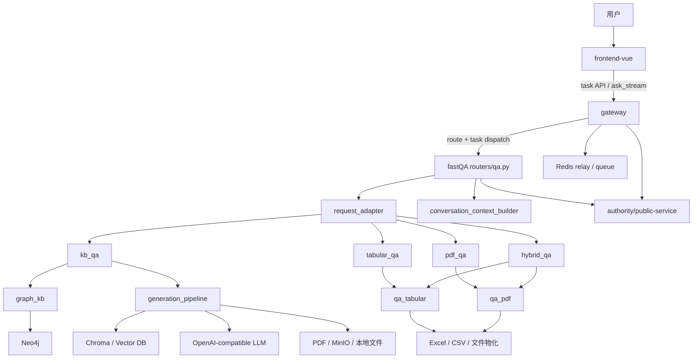
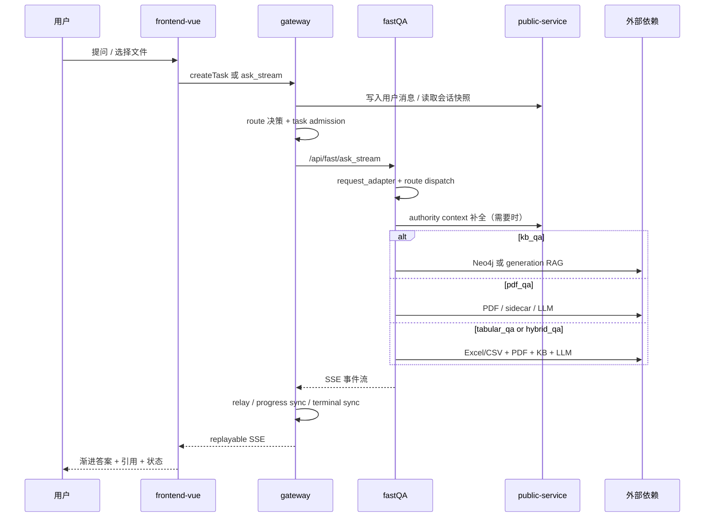

# fastQA 系统总览

## 1. 系统边界

`fastQA` 不是一个独立前后端闭环，而是整个问答系统中的“快速问答后端”。它的上游是 `gateway`，下游会同时依赖会话持久化、公有服务、向量检索、PDF 本地/对象存储、LLM、Redis、Neo4j 等组件。

| 服务/目录 | 角色 | 当前职责 |
| --- | --- | --- |
| `frontend-vue/` | 前端 UI | 聊天界面、任务恢复、SSE 消费、引用展示 |
| `gateway/` | 统一入口 | 鉴权、路由决策、任务创建、调度、SSE relay、配额、对话持久化代理 |
| `fastQA/` | 快速问答后端 | `kb_qa`、`pdf_qa`、`tabular_qa`、`hybrid_qa` 的执行 |
| `public-service/` | 公共能力服务 | 会话快照读取、消息持久化、内部上下文 authority |
| `resource/` | 配置与运行资源 | 向量库、PDF、JSON、缓存目录、共享配置 |

## 2. fastQA 内部模块职责

| 模块 | 主要文件 | 职责 |
| --- | --- | --- |
| 启动与运行态 | `app/main.py`、`app/core/runtime.py` | 初始化 FastAPI、Redis、generation runtime、graph_kb runtime |
| API 路由 | `app/routers/qa.py` | 统一处理 `/ask` / `/ask_stream`，根据 route 分发到 KB / PDF / 表格 / 混合链路 |
| 请求适配 | `app/services/request_adapter.py` | 把 gateway 下发 payload 规范化为 `GatewayAskRequest`，校验 route/source_scope/文件契约 |
| 会话上下文 | `app/services/conversation_context_builder.py` | 合并 authority 快照与请求 chat history，生成 RAG 可消费的上下文 |
| authority 客户端 | `app/services/conversation_authority_client.py` | 读写 `public-service` 的会话上下文与消息状态 |
| generation RAG | `app/modules/generation_pipeline/` | `kb_qa` 主链路：stage1 规划、stage2 检索、stage2.5 MD 扩展、stage3 PDF 证据、stage4 合成 |
| 图谱快捷链路 | `app/modules/graph_kb/` | 在 `kb_qa` 前置尝试 Neo4j 模板查询 |
| PDF 问答 | `app/modules/qa_pdf/` | 单 PDF、多 PDF、DOI 直查、sidecar、严格基于 PDF 的回答 |
| 表格问答 | `app/modules/qa_tabular/` | 工作簿加载、schema profiling、规则规划、pandas 执行、答案渲染 |
| 文档与存储 | `app/modules/storage/`、`app/modules/documents/` | 已上传文件定位、本地物化、PDF 文件访问 |
| LLM 适配 | `app/integrations/llm/` | OpenAI-compatible 调用封装 |

## 3. 模块调用关系图

## 4. 从用户提问到最终回答的数据流

### 4.1 当前主路径

前端在开启 `VITE_REFRESH_SURVIVABLE_QA_TASKS_ENABLED` 时，优先走“可恢复任务模式”：

1. `frontend-vue/src/services/api.js` 调 `createTask()`
2. `gateway/app/routers/tasks.py` 创建任务
3. 前端用 `streamTaskEvents()` 订阅 `/api/v1/tasks/{task_id}/events`
4. gateway 在事件流首次附着时触发 admission + upstream 执行
5. `fastQA` 按 route 产生上游 SSE 事件
6. gateway relay 存储并回放事件
7. `frontend-vue/src/views/Home.vue` 的 `applyGatewayEvent()` 消费 `state/step/thinking/content/done/error`
8. UI 渐进渲染答案、引用、metadata、时延信息

### 4.2 端到端数据流图

## 5. 关键函数 / 文件对照

| 文件 | 关键入口 | 作用 |
| --- | --- | --- |
| `fastQA/app/main.py` | `create_app()` | 注册 runtime、router、hook |
| `fastQA/app/core/runtime.py` | `bootstrap_generation_runtime()` / `bootstrap_graph_kb()` | 初始化 generation runtime 与 Neo4j 客户端 |
| `fastQA/app/routers/qa.py` | `ask()` / `ask_stream()` / `_iter_route_events()` | FastQA 核心入口与 route 分发 |
| `fastQA/app/services/request_adapter.py` | `adapt_gateway_ask_payload()` | 规范化 gateway 请求契约 |
| `fastQA/app/services/conversation_context_builder.py` | `build_conversation_context()` | 构造最近对话、摘要、文件选择上下文 |
| `fastQA/app/services/conversation_authority_client.py` | `read_context_snapshot()` / `accept_assistant_turn_async()` | 连接 `public-service` 做 authority 读写 |
| `frontend-vue/src/services/api.js` | `createTask()` / `streamTaskEvents()` | 前端任务 API 入口 |
| `frontend-vue/src/views/Home.vue` | `applyGatewayEvent()` | 前端事件到 UI 状态的核心映射 |

## 6. RAG 之外的存储与外部依赖

| 依赖 | 用途 | 代码入口 |
| --- | --- | --- |
| Redis | gateway 任务队列、lease、relay store、状态索引 | `gateway/app/services/execution_event_relay.py`、`execution_admission.py` |
| public-service | 会话 authority 快照、消息持久化、任务状态同步 | `fastQA/app/services/conversation_authority_client.py`、gateway persistence service |
| Neo4j | `graph_kb` 模块的模板化图谱查询 | `fastQA/app/core/runtime.py`、`fastQA/app/modules/graph_kb/` |
| Chroma / 向量库 | generation pipeline 的文献检索与 MD 扩展 | `generation_pipeline/stage2_retrieval.py`、`md_expansion.py` |
| 本地文件 / MinIO | PDF、表格、论文原文物化 | `pdf_pipeline.py`、`workbook_loader.py`、storage service |
| LLM(OpenAI-compatible) | generation RAG、PDF QA、表格答案合成 | `runtime_bootstrap.py`、`qa_pdf/llm_factory.py` |
| Embedding 服务 | 语义检索向量化 | `resource/config/services/fastQA/config.shared.env` 中 embedding 配置 |
| PDF sidecar | 单 PDF file-only 模式的旁路执行 | `qa_pdf/service.py`、`qa_pdf/sidecar_client.py` |

## 7. 当前架构观察

1. `fastQA` 已经不是单一路径问答服务，而是四类 route 的路由器加执行器。
2. gateway 与 fastQA 的边界比普通反向代理更深，gateway 持有任务状态机、quota、relay、终态恢复逻辑。
3. `kb_qa` 内部又分为两层：先尝试 `graph_kb`，失败后再落回 generation-driven RAG。
4. `hybrid_qa` 并不是一个单独的大模型链路，而是“根据 source_scope 把 PDF-only 混合问答转给 `qa_pdf`，其余转给 `qa_tabular`”。
5. 对话上下文不是简单透传 chat history，而是 authority 快照与请求历史合并后的受控上下文。

