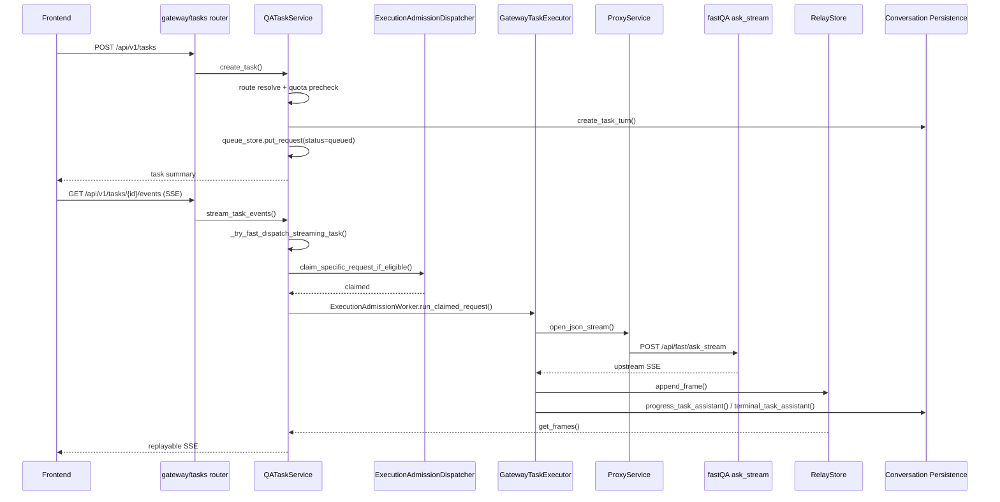

# gateway -> fastQA 调度与 relay 细节

## 1. 目标

本文件只聚焦 “可恢复任务模式” 下的链路，也就是：

- `POST /api/v1/tasks`
- `GET /api/v1/tasks/{task_id}/events`
- gateway 如何把任务调度到 fastQA
- fastQA 上游 SSE 如何被 relay、持久化、重放和终态收敛

## 2. 总体时序

## 3. 任务创建阶段

### 3.1 create_task 做了什么

`gateway/app/services/qa_tasks.py` 中的 `QATaskService.create_task()` 不是简单“插一条任务记录”，而是一次完整的准入准备：

1. 绑定当前鉴权用户，确认 `conversation_id` / `user_id`
2. 解析 route 与文件上下文
3. 做任务创建级 admission 检查，防止同会话/同用户并发冲突
4. 预探测目标 backend 健康状态
5. 先做 quota precheck，拿到 `grant_id`
6. 生成 queue record，附带 `execution_snapshot`
7. 调 conversation persistence 创建 task turn，拿到 `user_message_id` / `assistant_message_id`
8. 将记录状态改为 `queued`
9. 向 relay 追加一条 `state=queued`

### 3.2 execution_snapshot 的价值

`execution_snapshot` 是整个任务链条里最关键的可恢复上下文，包含：

- 原始问题
- conversation/user 标识
- chat history
- requested / actual mode
- route / source_scope / turn_mode
- selected/execution files
- strategy / file_selection
- authority 相关字段
- quota grant
- trace/task 信息

这意味着 gateway 在真正执行时，不需要重新依赖前端 payload，而是依赖自己持久化下来的“执行快照”。

## 4. 首次附着时的即时调度

### 4.1 触发点

`stream_task_events()` 一进入就调用 `_try_fast_dispatch_streaming_task()`。也就是说：

- 任务不是在 `create_task` 时立刻执行
- 而是在“客户端真的开始订阅事件流”时尝试即时抢占并执行

这使得 gateway 可以把“创建任务”和“开始消费结果”耦合起来，减少空跑。

### 4.2 claim 逻辑

`ExecutionAdmissionDispatcher.claim_specific_request_if_eligible()` 只有在以下条件满足时才会 claim：

- 任务当前状态仍为 `queued`
- 该任务正好是当前调度器选出的“下一个可执行任务”
- 对应容量桶还有并发余量
- backend readiness 允许继续

### 4.3 容量桶与公平性

`gateway/app/services/execution_admission.py` 把执行容量分为：

- `thinking`
- `fast_or_patent`

特点：

- 总并发受 `max_concurrent` 限制
- `thinking` 有单独最大并发
- 支持 `thinking_min_slots` 这类保留槽位思路
- 对老化的 `thinking` 请求做饥饿保护

含义：

- 即便本次分析聚焦 `gateway -> fastQA`，它也运行在整个 admission 体系里
- fastQA 任务会与非 thinking 任务共享 `fast_or_patent` 容量桶

## 5. 执行器如何把任务转成 fastQA 上游流

### 5.1 上游请求构造

`GatewayTaskExecutor._execute_async()` 会构造一个“内部请求”再转发到上游：

- 路径：`/api/{actual_mode}/ask_stream`
- 关键内部头：
  - `x-gateway-task-execution: 1`
  - `x-gateway-owned-persistence: 1`
  - `x-internal-service-name: gateway`
  - `x-internal-service-token: <internal token>`

这说明 gateway 不是纯透明代理，而是以“系统内部执行者”的身份调用 fastQA。

### 5.2 上游 payload 来源

上游 JSON body 来自 `_upstream_payload()`，本质上是 `execution_snapshot` 的再利用，而不是重新拼前端请求。

### 5.3 上游事件消费

执行器对 fastQA 的 SSE 帧做如下处理：

- `metadata`: 更新 telemetry，但不一定写入 relay 内容流
- `thinking`: 转成 step 进度并尽快 flush 到 persistence
- `step`: 合并 step map，更新 UI 进度
- `content`: 累积正文并按节流策略同步
- `done`: 写入 terminal assistant，完成 quota finalize
- `error`: 终态失败并补写失败信息

## 6. relay store 的职责

`gateway/app/services/execution_event_relay.py` 的 `ExecutionEventRelayStore` 是整个可恢复任务模式的基础设施。

### 6.1 它存什么

- 帧列表
- 当前最大本地 sequence
- 最近的 upstream `seq`
- cursor
- frame count
- TTL 与 request 索引

### 6.2 它解决什么问题

1. 客户端断线后可从 `after_seq` 继续回放
2. 如果上游重复推某个 `seq`，可基于 upstream sequence 去重
3. 一旦遇到终态帧，不再接受后续追加
4. 可用 Redis 落地，也支持内存 fallback

### 6.3 终态语义

relay 认为以下内容是终态：

- `done`
- `error`
- `state=completed/failed/canceled/expired`

终态之后：

- 后续帧会被忽略
- 回放在 drain 完现有帧后停止

## 7. 进度同步与终态同步

gateway 除了 relay 给前端，还要把执行过程写回 conversation persistence。

### 7.1 进度同步

`_sync_progress()` / `_sync_progress_best_effort()` 负责：

- 增量正文
- steps
- last_seq
- running/admitted 状态

如果同步失败，不会立刻把任务置失败，而是写入：

- `progress_sync_pending`
- `progress_sync_payload`

### 7.2 终态同步

`done` 或 `error` 之后，gateway 调 `terminal_task_assistant()` 写入终态；若失败则记录：

- `terminal_sync_pending`
- `terminal_sync_payload`

这意味着任务“对前端已完成”与“对持久化系统已收敛”并不是同一个时刻。

### 7.3 quota finalize

终态时还会调用 quota finalize。若 quota finalize 失败，也会借助 terminal pending 机制做补偿收敛。

## 8. 关键函数 / 文件对照

| 文件 | 函数 | 作用 |
| --- | --- | --- |
| `gateway/app/routers/tasks.py` | `create_task()` / `get_task_events()` | 对外任务 API |
| `gateway/app/services/qa_tasks.py` | `create_task()` | 任务创建、quota precheck、execution snapshot 持久化 |
| `gateway/app/services/qa_tasks.py` | `stream_task_events()` | 事件流读取、首次附着触发即时 dispatch |
| `gateway/app/services/qa_tasks.py` | `_try_fast_dispatch_streaming_task()` | 立即 claim + 拉起 worker |
| `gateway/app/services/qa_tasks.py` | `_execute_async()` | 打开上游流、消费帧、relay、同步持久化 |
| `gateway/app/services/execution_admission.py` | `claim_specific_request_if_eligible()` | 仅在“轮到它且容量允许”时抢占指定任务 |
| `gateway/app/services/execution_admission.py` | `transition_to_running()` / `complete_request()` | admission 状态机迁移 |
| `gateway/app/services/execution_event_relay.py` | `append_frame()` / `get_frames()` | 帧存储、去重、回放 |
| `gateway/app/services/proxy.py` | `open_json_stream()` | 以 JSON body 打开上游 SSE |
| `gateway/app/services/backend_registry.py` | `get_mode_backend()` | 选择 fast / thinking / patent backend |

## 9. 发现的问题与差距

1. gateway 任务链路功能很完整，但状态机复杂度明显高，问题一旦落在 “relay 成功、持久化失败、quota finalize 失败” 这类分叉点，排障成本会很高。
2. 即时调度依赖“首次 SSE attach”，这是一个很务实的优化，但也让“创建任务成功但暂未 attach”这一中间态更加重要。
3. progress sync / terminal sync 都有 pending 补偿逻辑，说明系统已经意识到外部持久化不稳定；反过来讲，也意味着线上必须有专门的巡检或 reconciliation 观察面板。
4. admission 体系是全局共享的，fastQA 的吞吐受 `fast_or_patent` 桶影响，不是完全独立。
5. 前端仍然保留了 task 模式与 legacy `ask_stream` 双路径，系统认知负担较高。

