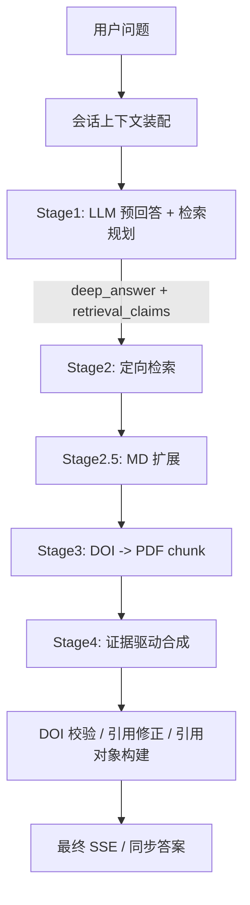

# RAG / Planner / Retriever / LLM 链路

## 1. 适用范围

本文件描述 `kb_qa` 在没有命中 `graph_kb` 快捷链路时的主执行路径，也就是 generation-driven RAG。

主入口：

- `fastQA/app/routers/qa.py` 中 `_iter_route_events()`
- `fastQA/app/modules/generation_pipeline/generation_driven_rag_facade.py`

## 2. 总体流程图

## 3. 上下文如何进入 RAG

### 3.1 会话上下文来源

`build_conversation_context()` 会把以下信息整理成统一结构：

- authority 最近对话
- 请求侧 chat history
- authority summary
- authority conversation_state
- 文件选择信息

输出结构包括：

- `recent_turns_for_llm`
- `summary_for_llm`
- `conversation_state`
- `source_selection`

### 3.2 为什么要做归一化

它不是简单拼接聊天记录，而是做了：

- authority 和 request history 的 overlap 去重
- 只保留 user/assistant 角色
- 消息长度预算控制
- 摘要字段压缩
- 文件选择上下文标准化

这一步是后续 stage1 / stage4 能承接上下文、但又不至于无限膨胀 prompt 的基础。

## 4. Stage1: 预回答与检索规划

### 4.1 核心职责

`stage1_planning.py` 的 `run_stage1_pre_answer_and_planning()` 做两件事：

1. 先生成一个“深度初稿” `deep_answer`
2. 再把需要文献核实的点拆成 `retrieval_claims`

### 4.2 输入内容

Stage1 的 system prompt 由两部分组成：

- `prompt_templates.py` 中的 `STAGE1_PROMPT`
- 向量库 topic index 导出的上下文说明

user content 则会拼入：

- 会话摘要
- 最近对话
- 当前问题

### 4.3 输出形态

理想输出是 JSON，包含：

- `deep_answer`
- `retrieval_claims`

每条 `retrieval_claim` 又可带：

- `claim`
- `keywords`
- `preferred_sections`
- `filters`

### 4.4 降级策略

如果 stage1 JSON 解析失败，系统不会中止，而是降级为：

- `deep_answer = 原始模型输出`
- `retrieval_claims = []`

这会导致后续检索深度明显下降，但服务仍能继续输出答案。

## 5. Stage2: 检索规划落地

### 5.1 核心流程

`run_stage2_targeted_retrieval()` 的每条 claim 处理顺序大致是：

1. 尝试用 LLM 生成更适合检索的 query
2. 若失败则回退为“claim + keywords”的传统 query
3. 可选 query expansion
4. 强制关键词注入与实体锁定
5. 调 `literature_expert.search()`
6. 可选 rerank
7. relevance validation
8. 对所有 claim 结果做去重聚合

### 5.2 Query guardrail

这一层很重要。它不是单纯向量检索，而是显式防止“用户问 Ti，却检到 Mg”的语义漂移。主要手段：

- 强制注入 question keywords
- 元素实体锁定
- 对被 conversation wrapper 包起来的问题做去噪

### 5.3 并发策略

Stage2 支持：

- 固定并发 worker
- 基于当前 active stream count 的动态降并发

说明系统已经把“多请求同时在跑”视为检索性能的重要变量。

## 6. Stage2.5: Markdown 扩展

`run_stage25_md_expansion()` 会在已有 DOI 候选基础上，再去第二套 MD collection 中补充 chunk。

特点：

- 可按 DOI 精准扩展
- 也可做 global supplement
- 最终会把 MD chunk 与 PDF chunk 合并去重

这一步本质上是在做“同一篇文献不同载体的证据补充”。

## 7. Stage3: DOI -> PDF 证据

`pdf_pipeline.py` 的 `stage3_load_pdf_chunks()` 会：

1. 根据 DOI 找 PDF
2. 本地或对象存储物化 PDF
3. 读前若干页
4. 按段落切 chunk
5. 为每个 DOI 形成 `doi -> chunks` 映射

这说明最终合成并不是只靠摘要向量库，而是会回溯论文原文片段。

## 8. Stage4: 证据驱动的最终合成

### 8.1 Prompt 形态

Stage4 有三种模式：

- legacy stage2 prompt 直接合成
- two-stage fact synthesis
- structure only synthesis

由环境变量决定是否开启 two-stage / structure-only。

### 8.2 证据输入

Stage4 真正使用的核心输入是：

- `user_question`
- `deep_answer`
- `evidence_documents`（由 PDF / MD chunk 格式化而来）
- top-k reference context
- conversation context

### 8.3 合成后的修正

Stage4 结束后还会做：

- DOI 提取
- 与 `pdf_chunks` 的 DOI 交叉验证
- 去除无效 DOI
- top-k 覆盖率日志
- 引用对象构造

所以它不是“模型一口气吐完就结束”，还有一层 postprocess。

## 9. LLM 调用链路

### 9.1 runtime 初始化

`bootstrap_generation_runtime()` 会：

1. 从环境解析 API key / base URL / model
2. 初始化 OpenAI-compatible client
3. 初始化 `GenerationDrivenRAG`
4. 初始化 `literature_expert`

### 9.2 实际调用位置

| 阶段 | 调用方式 | 主要文件 |
| --- | --- | --- |
| Stage1 | `client.chat.completions.create()` | `stage1_planning.py` |
| Stage2 query generation | `client.chat.completions.create()` | `stage2_retrieval.py` |
| Query expansion | 独立 `QueryExpander` | `query_expander.py` |
| Stage4 synthesis | `client.chat.completions.create(stream=True)` | `synthesis_streaming.py` |

## 10. 关键函数 / 文件对照

| 文件 | 函数 / 类 | 作用 |
| --- | --- | --- |
| `generation_driven_rag_facade.py` | `GenerationDrivenRAG` | generation RAG 的总编排器 |
| `stage1_planning.py` | `run_stage1_pre_answer_and_planning()` | 预回答 + claim 规划 |
| `stage2_retrieval.py` | `run_stage2_targeted_retrieval()` | 按 claim 精准检索 |
| `query_expander.py` | `QueryExpander.expand()` | 查询扩展 |
| `md_expansion.py` | `run_stage25_md_expansion()` | MD collection 扩展 |
| `pdf_pipeline.py` | `stage3_load_pdf_chunks()` | DOI 回溯 PDF 原文 chunk |
| `synthesis_streaming.py` | `iter_stage4_synthesis_with_pdf_chunks()` | 流式最终答案合成 |
| `prompt_templates.py` | `STAGE1_PROMPT` / `STAGE2_PROMPT` | 核心 prompt 模板 |
| `runtime_bootstrap.py` | `resolve_generation_runtime_inputs()` / `build_openai_client()` | LLM 运行时初始化 |

## 11. 发现的问题与差距

1. Stage1 一旦 JSON 解析失败，就退化成“只有 deep_answer、没有 retrieval_claims”，这会让系统虽然还能答，但证据链明显变浅。
2. Stage2 很强调 query 约束与 rerank，但最终质量仍然强依赖 `literature_expert.search()` 的底层集合质量和 metadata 完整性。
3. Stage2.5 和 Stage3 都在补证据，但证据合并仍然是“先召回、再去重”的思路，不是严格的统一证据排序框架。
4. Stage4 要求强引用、强 DOI、强机理解释、强定量信息，本质上仍是 prompt discipline 驱动，而不是结构化强约束生成。
5. conversation context 已接入 Stage1 和 Stage4，但“如何既承接上下文又不污染证据优先级”仍主要依赖提示词，而不是硬边界。

