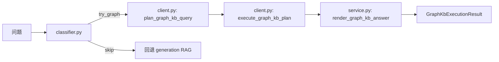

# graph_kb 与实际 Neo4j schema 差距

## 1. 当前 graph_kb 的代码结构

`graph_kb` 不是通用图谱问答引擎，而是一条很窄的“图谱快捷模板链路”：

它的核心特点是：

- 先分类，不是所有 `kb_qa` 都尝试图谱
- 分类失败或 plan 失败就立刻回退 generation RAG
- plan 使用硬编码正则与模板
- execute 使用固定 Cypher 模板
- render 对若干字段做字符串清洗和特例解析

## 2. config.shared.env 中与 graph_kb 相关的配置

`resource/config/services/fastQA/config.shared.env` 里只有开关与查询限制：

| 配置项 | 默认值 | 含义 |
| --- | --- | --- |
| `FASTQA_GRAPH_KB_ENABLED` | `0` | graph_kb 默认关闭 |
| `FASTQA_GRAPH_KB_TIMEOUT_MS` | `3000` | 单次图查询超时 |
| `FASTQA_GRAPH_KB_MAX_ROWS` | `20` | 最大结果行数 |
| `FASTQA_GRAPH_KB_QUERY_LOGGING` | `0` | 图查询日志开关 |

注意：

1. shared env 里没有 `NEO4J_URL` / `NEO4J_USERNAME` / `NEO4J_PASSWORD`。
2. `fastQA/app/core/runtime.py` 的 `bootstrap_graph_kb()` 运行时会直接从进程环境读取这些 Neo4j 连接参数。
3. 也就是说，图谱开关在 shared 配置里，连接信息不在 shared 配置里，而在本地/私有运行环境里。

## 3. 当前实现实际支持的模板

`plan_graph_kb_query()` 只支持 5 个模板：

| 模板 ID | 触发方式 | 结果 |
| --- | --- | --- |
| `lookup_by_doi` | 直接问 DOI | 查标题与部分原料 |
| `expand_doi_context_by_doi` | DOI + 测试/工艺提示词 | 展开测试、制备方法、关键参数 |
| `list_by_material` | “有哪些关于 X 的文献” | 列文献 |
| `list_by_raw_material` | “哪些文献使用 X 作为原料” | 按原料列文献 |
| `count_by_filter` | “X 有多少篇文献” | 计数 |

对应限制：

- 没有数值比较模板
- 没有排序/TopK 模板
- 没有多条件布尔组合模板
- 没有多跳聚合模板
- 没有 follow-up 指代解析模板

## 4. classifier 的前置过滤逻辑

`classifier.py` 会主动跳过很多问题：

### 4.1 有文件上下文就跳过

只要最近一轮 route 是：

- `pdf_qa`
- `tabular_qa`
- `hybrid_qa`

或者 `source_selection` 里已经带了 PDF / table / selected files，就不走图谱。

### 4.2 宽泛语义问题直接跳过

以下类型会被视为“不适合 graph_kb 模板”：

- 为什么
- 如何
- 意义
- 总结
- 介绍
- 综述
- 机制
- 趋势
- 方法对比

### 4.3 模糊追问直接跳过

如：

- 它
- 这个
- 那篇
- 前者 / 后者
- 上面那个
- 最高的是哪篇

## 5. 已探查到的实际 Neo4j schema 形态

以下结论来自此前已完成的一次本机 Neo4j 实图探查。

### 5.1 总体判断

真实图谱并不是“Article / Material / Process / Step” 这种干净的领域图，而更像“字段节点图”：

- 许多 label 本身就是字段名
- 大量值被塞进节点 `name` 字段里
- 关系类型也常常是字段名
- 不少“看起来像领域实体类”的标签实际是空的

### 5.2 高计数标签样例

| 标签 | 节点数 | 观察 |
| --- | ---: | --- |
| `discharge_capacity` | 122452 | 更像性能字段桶，不像实体类 |
| `name` | 83283 | 字段节点 |
| `testing` | 63387 | 测试项字段桶 |
| `raw_materials` | 55319 | 原料字段桶 |
| `description` | 51427 | 描述字段桶 |
| `parameters` | 45989 | 参数字段桶 |
| `step_name` | 44377 | 步骤名称字段桶 |
| `doi` | 14075 | 文献 DOI 节点 |
| `title` | 12374 | 标题节点 |
| `process` | 10678 | 工艺字段桶 |
| `recipe` | 10678 | 配方字段桶 |
| `equipment` | 10677 | 设备字段桶 |
| `key_process_parameters` | 10677 | 关键工艺参数字段桶 |
| `process_steps` | 10676 | 工艺步骤字段桶 |

### 5.3 存在但为空的“理想标签”

这些标签在库里存在，但节点数为 0：

| 标签 | 节点数 |
| --- | ---: |
| `Article` | 0 |
| `Entity` | 0 |
| `Equipment` | 0 |
| `Material` | 0 |
| `Process` | 0 |
| `Step` | 0 |
| `__Chunk__` | 0 |
| `__Document__` | 0 |
| `__Entity__` | 0 |

含义：

- 代码很容易误以为这是一个语义图
- 实际上真正有数据的是“小写字段 label”，不是“高层语义 label”

### 5.4 关系类型样例

| 关系 | 形态 |
| --- | --- |
| `doi -> process` | 文献连到工艺字段桶 |
| `doi -> raw_materials` | 文献连到原料字段桶 |
| `doi -> recipe` | 文献连到配方字段桶 |
| `doi -> equipment` | 文献连到设备字段桶 |
| `doi -> testing` | 文献连到测试字段桶 |
| `process -> step_name` | 工艺连到步骤名称字段 |
| `process -> materials` | 工艺连到材料字段 |
| `process -> process_steps` | 工艺连到步骤字段 |
| `process -> key_process_parameters` | 工艺连到关键参数字段 |
| `recipe -> carbon_source` | 配方连到子字段 |
| `recipe -> additives` | 配方连到子字段 |
| `recipe -> Fe_P_ratio` | 配方连到比例字段 |
| `recipe -> Li_Fe_ratio` | 配方连到比例字段 |
| `testing -> testing` | 字段桶到字段值的“同名自循环式”关系 |
| `discharge_capacity -> discharge_capacity` | 字段桶到字段值的同名关系 |
| `raw_materials -> raw_materials` | 字段桶到字段值的同名关系 |

### 5.5 节点属性模式

实探样本显示，大量节点属性只有：

- `name`
- `louvainCommunityId`

意味着：

- 大部分结构化语义没有展开成独立属性列
- 查询往往只能靠 `name` 的字符串匹配

### 5.6 典型样本值

此前探查到的样本值形态如下：

| 标签 | 样本值 |
| --- | --- |
| `doi.name` | `10.1039/c4ra15767b` |
| `preparation_method.name` | `Core-shell SiO₂(Li⁺) nanoparticles synthesis and composite polymer electrolyte preparation` |
| `milling.name` | `method_ball milling_time_null_speed_null_ball_powder_ratio_null_other_params_null` |
| `discharge_capacity.name` | `discharge_capacity7_10.1039/c4ra15767b` |

这说明数值、工艺参数、DOI 之间经常被编码进一个字符串，而不是多个可筛选字段。

## 6. 代码假设与真实 schema 的差距

| 代码侧假设 | 真实 schema | 结果 |
| --- | --- | --- |
| 图谱可按“实体类 + 关系”理解 | 图谱更像“字段名节点 + 字符串值” | 模板泛化能力弱 |
| 可以靠简单 `contains` 命中材料/原料/标题 | 很多信息被编码在 `name` 字符串里 | 命中依赖字符串偶然性 |
| DOI 展开后能拿到较规整的 testing/process 信息 | testing/process 多是字段桶或拼接串 | render 需要大量清洗 hack |
| 数值字段可用于过滤或排序 | 数值常嵌在字符串中 | 几乎无法稳定做数值比较 |
| 高层标签如 `Article/Material/Process` 可作为未来扩展基础 | 这些标签多数为空 | 无法直接扩展为通用 Cypher 模型 |

## 7. 当前覆盖不了的查询场景

### 7.1 数值阈值类

当前模板覆盖不了：

- “比容量大于 160 mAh/g 的文献有哪些”
- “压实密度高于 2.4 的配方有哪些”
- “电压在 3.3V 左右的样本有哪些”

原因：

- classifier 已把“容量 / 电压 / 大于 / 最高”等识别为 property filter 信号
- plan 中也没有数值筛选模板
- 实际 schema 又缺少稳定的数值属性列

### 7.2 排序 / TopK 类

覆盖不了：

- “压实密度最高的前 5 篇文献”
- “循环性能最好的材料是什么”
- “倍率性能排名前 10 的工艺路线”

### 7.3 多条件组合类

覆盖不了：

- “使用草酸亚铁作原料且煅烧温度高于 700℃ 的文献”
- “同时包含 Ti 掺杂和碳包覆的文献”
- “原料 A + 工艺 B + 测试条件 C 的交集”

### 7.4 多跳归纳类

覆盖不了：

- “某原料通常对应哪些制备步骤”
- “某类工艺下常见的测试组合”
- “配方、工艺、性能三跳关联的归纳”

### 7.5 追问与语义型问题

覆盖不了：

- “它为什么更好”
- “上面那篇的工艺细节是什么”
- “这种方法的机制是什么”

这些问题会被 classifier 直接跳过，回退到 generation RAG。

## 8. 关键函数 / 文件对照

| 文件 | 函数 | 作用 |
| --- | --- | --- |
| `graph_kb/classifier.py` | `classify_graph_kb_question()` | 决定 try_graph 还是 skip |
| `graph_kb/client.py` | `plan_graph_kb_query()` | 从正则模式生成模板 plan |
| `graph_kb/client.py` | `_cypher_and_params()` | 5 个模板对应的 Cypher |
| `graph_kb/client.py` | `execute_graph_kb_plan()` | 执行带超时的图查询 |
| `graph_kb/service.py` | `render_graph_kb_answer()` | 对结果做字符串解析并生成回答 |
| `graph_kb/service.py` | `try_graph_kb_answer()` | 连接 classifier / plan / execute / render |
| `fastQA/app/core/runtime.py` | `bootstrap_graph_kb()` | 从运行时环境初始化 Neo4j 客户端 |

## 9. 发现的问题与差距

1. `graph_kb` 当前本质是“有限模板加速器”，不是通用图谱 QA 层。
2. shared 配置只控制开关和限制，真正的 Neo4j 连接参数散落在运行时环境，配置面与运行面存在割裂。
3. 真实 schema 采用字段桶与字符串编码，决定了当前 hardcoded Cypher 很难扩展到数值过滤、聚合、排序、组合检索。
4. `render_graph_kb_answer()` 已经出现较多字符串解析逻辑，这通常意味着图谱本体设计没有为查询层提供稳定结构。
5. 一旦问题稍微偏离 DOI 查找、文献枚举、原料枚举，当前图谱链路就会失效并回退 generation RAG。

