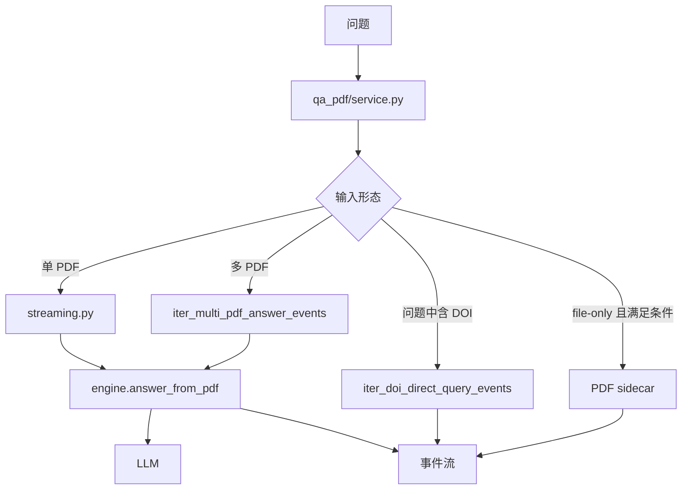
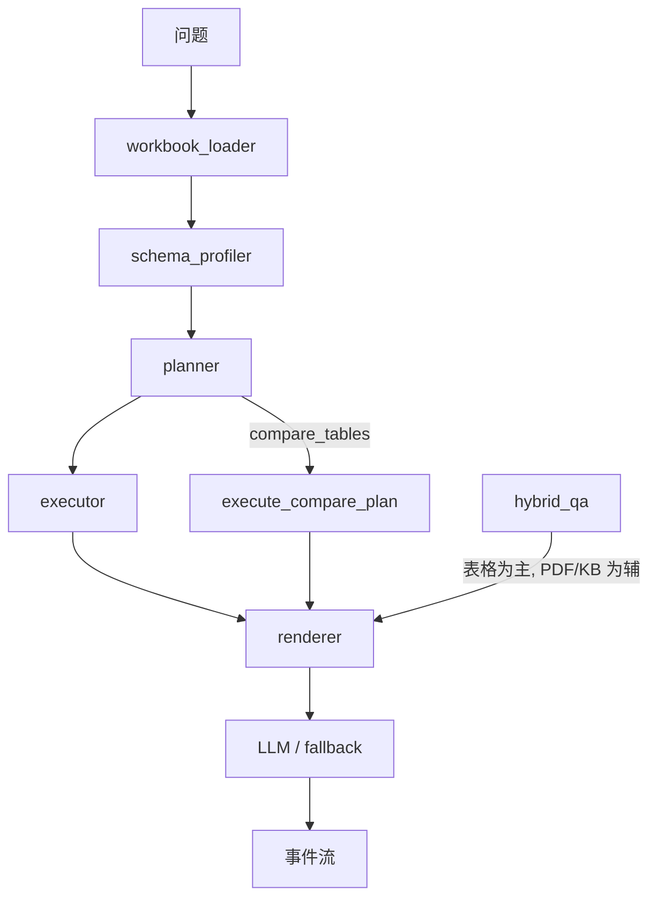

# qa_pdf / qa_tabular 链路、prompt 与答案合成

## 1. 总览

`pdf_qa` 与 `tabular_qa` 都不属于 generation RAG 主链，而是 fastQA 针对“文件上下文”单独做的两套执行器。`hybrid_qa` 并不是第三套全新推理内核，而是根据 source scope 落到这两套执行器之一。

## 2. qa_pdf

### 2.1 执行路径

### 2.2 Prompt 策略

`qa_pdf/prompting.py` 的核心约束非常明确：

- 只能基于 PDF 原文回答
- 禁止使用预训练通用知识补充
- 禁止编造 PDF 未提及内容
- 若未提及，应直接说“PDF 中未提及”

它有两套 prompt：

1. 普通问答 prompt
2. 总结类 prompt

总结类 prompt 会额外强调：

- 不仅看摘要，要看全文
- 研究目的、方法、结果、结论都要从全文提取

### 2.3 KB verification 的定位

`build_kb_section()` 明确把知识库信息定位为：

- 只能验证 PDF 中已经出现的内容
- 不能补充 PDF 没写的事实
- 不能替代 PDF 原始数据

也就是说 `qa_pdf` 里的 KB 不是主证据源，而是验证侧证据。

### 2.4 截断策略

`truncation.py` 的策略不是简单截断头部，而是：

- 单文档：按章节优先级保留摘要、引言、结果、讨论、结论、方法
- 问题导向：性能问题优先结果，工艺问题优先方法
- 多文档：先识别“文献分隔头”，再均衡配额分给每篇文献

这说明 `qa_pdf` 已经意识到“长文 / 多文档”不能只靠粗暴裁剪。

### 2.5 答案合成与流式策略

`engine.answer_from_pdf()` 的特点：

- 支持 stream 和 invoke 两种模式
- 有首 token timeout
- 流式消费失败时回退非流式 invoke
- 最后还会扫描 generic phrase，提醒答案可能混入常识

`streaming.py` 再把它包装成统一事件：

- `metadata`
- `thinking`
- `content`
- `done`

## 3. qa_tabular

### 3.1 执行路径

### 3.2 planner 不是 LLM，而是规则引擎

`qa_tabular/planner.py` 主要通过规则检测 operation：

| operation | 说明 |
| --- | --- |
| `summary` | 全表概览 |
| `count_rows` | 计数 |
| `lookup` | 按过滤条件查值 |
| `filter_rows` | 筛选行 |
| `aggregate` | 均值/求和/最大/最小 |
| `groupby` | 分组统计 |
| `trend` | 趋势 |
| `topk_desc` / `topk_asc` | 排序前 K / 后 K |
| `compare_tables` | 多表对比 |
| `compound` | 复合问题拆分 |

planner 同时还负责：

- sheet 匹配
- column 匹配
- filter 抽取
- 多表列对齐
- 需要澄清时的错误消息生成

### 3.3 schema profiler 的作用

`schema_profiler.py` 会给每个工作簿建立轻量 schema：

- sheet 名
- 列名
- normalized name
- 是否数值列
- sample values
- missing ratio

这个 profile 是 planner 能做自然语言匹配的基础。

### 3.4 executor 的性质

`executor.py` 不是检索器，而是“全表执行器”：

- 读入 pandas DataFrame
- 执行过滤
- 执行 groupby / aggregate / trend / topk / compare
- 输出结构化 `summary_stats` + `result_rows`

也就是说，在 `qa_tabular` 里，模型不是拿原始表格瞎猜，而是拿真实计算结果做语言化回答。

## 4. qa_tabular 的答案合成策略

### 4.1 先构造 deterministic context，再调 LLM

`renderer.build_tabular_result_context()` 先把执行结果转成稳定文本：

- 文件名
- 工作表
- 操作类型
- 过滤前后行数
- summary stats
- 过滤条件
- 样例结果
- warnings

LLM 拿到的是“已经执行过的结果文本”，而不是整个 DataFrame。

### 4.2 非 hybrid prompt

普通表格问答 prompt 的基本规则是：

- 执行结果来自后端真实计算
- 不允许编造
- 若问题是概览类，要优先用全表统计摘要
- 样例只用于举例，不能当成全量结论

### 4.3 hybrid prompt

hybrid 模式下，prompt 会明确写：

- 表格执行结果是真实计算结果，必须优先
- PDF / KB 证据只能解释、验证
- 不能覆盖表格结果

这代表 `hybrid_qa` 在设计上坚持“表格主真相，文献与图谱作辅证”。

## 5. hybrid_qa 在表格链路里的证据拼装

当 route 是 `hybrid_qa` 且不是 PDF-only 时，`QaTabularService.iter_answer_events()` 会额外做两件事：

### 5.1 PDF 证据抽取

不是调用 generation RAG，而是：

- 提取 PDF 文本或 preview
- 切 chunk / sentence window
- 用简单 token overlap + numeric overlap 打分
- 选前若干条 chunk 作为 `pdf_evidence_context`

这是一个轻量启发式证据检索，不是向量检索。

### 5.2 KB 证据注入

如果 `kb_enabled`，服务会把外部传入的：

- `kb_evidence_context`
- `kb_reference_instruction`
- `kb_references`

继续送进 renderer prompt。

## 6. 关键函数 / 文件对照

### 6.1 qa_pdf

| 文件 | 函数 / 类 | 作用 |
| --- | --- | --- |
| `qa_pdf/service.py` | `PdfQaService.iter_route_answer_events()` | PDF 问答总入口 |
| `qa_pdf/service.py` | `should_use_sidecar()` | 判断是否走 sidecar |
| `qa_pdf/service.py` | `iter_multi_pdf_answer_events()` | 多 PDF 模式 |
| `qa_pdf/streaming.py` | `iter_uploaded_pdf_answer_events()` | 单 PDF 事件流封装 |
| `qa_pdf/prompting.py` | `build_pdf_answer_prompt()` | 构造严格基于 PDF 的 prompt |
| `qa_pdf/truncation.py` | `smart_truncate_pdf_content()` | 智能截断 |
| `qa_pdf/engine.py` | `answer_from_pdf()` | 调 LLM 生成答案，支持 stream/invoke/fallback |

### 6.2 qa_tabular

| 文件 | 函数 / 类 | 作用 |
| --- | --- | --- |
| `qa_tabular/workbook_loader.py` | `load_workbook_cached()` | 表格文件物化与缓存 |
| `qa_tabular/schema_profiler.py` | `profile_workbook()` | 生成轻量 schema |
| `qa_tabular/planner.py` | `plan_tabular_query()` | 规则规划器 |
| `qa_tabular/executor.py` | `execute_tabular_plan()` / `execute_compare_plan()` | pandas 执行器 |
| `qa_tabular/renderer.py` | `build_tabular_result_context()` | 结构化执行结果文本化 |
| `qa_tabular/renderer.py` | `_build_tabular_prompt()` | 表格 / 混合问答 prompt |
| `qa_tabular/service.py` | `QaTabularService.iter_answer_events()` | 表格与混合问答总入口 |

## 7. 发现的问题与差距

1. `qa_pdf` 的“只基于 PDF 原文”主要靠 prompt 约束与 generic phrase warning，没有真正的强制 grounding validator。
2. 多 PDF 模式本质上是拼接多篇文献后统一回答，虽然有均衡截断，但没有独立的跨文献证据排序框架。
3. `qa_pdf` 的 KB verification 定位很克制，这是优点；但一旦模型不守规矩，系统也缺少硬性防线阻止它拿 KB 补全文本。
4. `qa_tabular` 的 planner 是规则驱动而不是 LLM 驱动，可解释性强，但对模糊表述、隐式列名、复杂复合问题更脆弱。
5. `qa_tabular` 的 hybrid PDF 证据检索是轻量 lexical heuristic，不是高精度语义检索。
6. `hybrid_qa` 的“表格优先、PDF/KB 辅助”是通过 prompt 保证的，最终仍依赖模型服从度。

