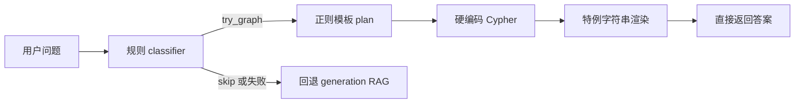
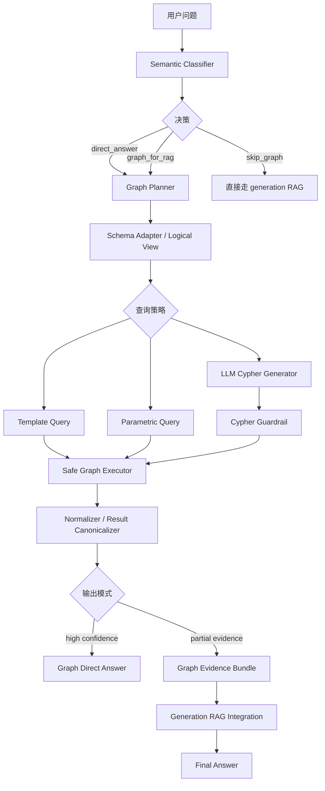
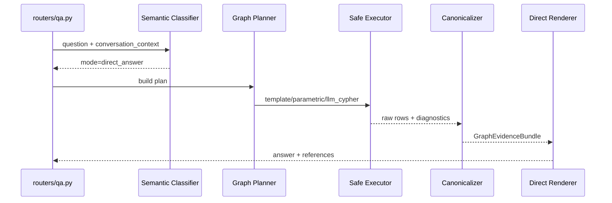
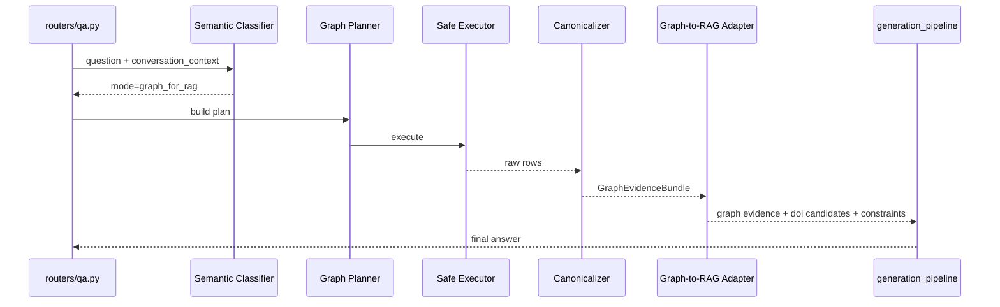

# fastQA graph_kb 升级方案设计

## 1. 文档目的

本文档定义 `fastQA graph_kb` 的升级方案，目标是在 **不重建当前 Neo4j 图数据结构** 的前提下，完成查询层升级，使 `graph_kb` 同时具备两种能力：

1. 保留高置信场景下的图谱快答直返能力
2. 在未直返时，将图谱结果标准化并注入后续 generation-driven RAG

约束前提：

- 短期内兼容当前 Neo4j 的字段桶 schema
- 不做图数据结构重建
- `schema 规范化` 只作为远期选项讨论
- 本文档仅做设计，不包含任何代码修改

---

## 2. 背景与现状

当前 `graph_kb` 是 `kb_qa` 路由中的一个前置快捷链路，其执行模式为：

这条链路对少量固定问题有效，但整体仍属于“模板化加速器”，不是一个可扩展的图谱问答层。

同时，之前已完成的 Neo4j 实图探查表明：当前图不是典型的“实体-关系-属性”规范图，而更接近“字段桶节点 + 字符串编码值”的图结构。这直接决定了 `graph_kb` 的升级重点不能放在“换更多模板”，而必须放在 **schema-aware 查询层、执行 guardrail、结果标准化、与 RAG 协作** 上。

---

## 3. 当前 graph_kb 的核心痛点

### 3.1 只有 5 个硬编码模板

当前仅支持：

- `lookup_by_doi`
- `expand_doi_context_by_doi`
- `list_by_material`
- `list_by_raw_material`
- `count_by_filter`

结果：

- 只能覆盖 DOI 查找、文献枚举、原料枚举、简单计数
- 无法覆盖数值阈值、排序、组合条件、多跳归纳、追问承接等主流图谱查询场景

### 3.2 classifier 过滤过宽

当前 classifier 会直接跳过：

- 宽泛语义问题：为什么、如何、意义、机制、趋势、方法对比
- 追问式问题：它、这个、那篇、前者、后者
- 文件上下文场景：上一轮如果是 `pdf_qa` / `tabular_qa` / `hybrid_qa` 就整体禁用 graph

结果：

- 许多“图谱可提供事实证据，但不适合直接独立回答”的问题也被完全挡掉
- `graph_kb` 只能“直返或不用”，不能“辅助 RAG”

### 3.3 Cypher 模板化严重

当前 Cypher 由 `_cypher_and_params()` 直接硬编码输出，问题包括：

- 依赖少数固定标签与路径
- 查询路径扩展困难
- 条件组合能力极弱
- 只适合已知关系走向，不适合复杂 schema 适配

### 3.4 关系方向与路径假设脆弱

当前查询中已经暴露出一类典型风险：**对 `name` 等关系方向的假设可能与真实图不一致**。这类问题会导致：

- 同一实体链路在图中实际存在，但 Cypher 命不中
- 表面看像“空结果”，实际是路径建模假设错误

这不是单个 bug，而是当前“直接写死路径”的架构性问题。

### 3.5 当前 schema 是字段桶形态，不是规范实体图

实探结果表明：

- 大量标签是字段名：`testing`、`raw_materials`、`process`、`recipe`
- 大量信息被编码在节点 `name` 字段中
- 许多看似规范的高层标签如 `Article`、`Material`、`Process` 实际为空

结果：

- 查询不能依赖“实体类 + 属性列”的标准图谱建模方法
- 需要额外的 schema 适配层把字段桶图解释为“逻辑实体视图”

### 3.6 render 层过多依赖字符串清洗

当前 `render_graph_kb_answer()` 已经包含很多：

- `null` 清理
- `_` 分隔值解析
- 方法/时间/温度/球粉比等字段的拼接拆解

说明：

- 数据层没有为问答层提供稳定结构
- 结果层不得不承担“半解析器”的职责

### 3.7 graph_kb 与 generation RAG 完全割裂

当前 graph 路径只会有两种结果：

1. 处理成功并直接回答
2. 处理失败后直接回退 generation RAG

中间缺了一层非常关键的能力：

- “graph 命中了部分证据，但不足以单独回答”
- “graph 适合做 DOI 候选、过程参数候选、实体约束”
- “graph 结果应该并入 Stage1/Stage2/Stage4”

---

## 4. 设计目标

### 4.1 目标

1. 在现有 Neo4j 字段桶 schema 上提升 graph_kb 覆盖率
2. 让 `graph_kb` 从“模板快答器”升级为“图谱查询层 + 图谱证据层”
3. 保持对 `kb_qa` 的低延迟直返能力
4. 在非直返场景下，把图谱结果稳定注入 generation RAG
5. 通过 guardrail 限制 LLM-Cypher 风险，保证只读、安全、可控
6. 分阶段演进，确保每个 phase 都可独立上线和回退

### 4.2 非目标

1. 不在短期内重建 Neo4j schema
2. 不将 graph_kb 改造成完全自治的 agent 系统
3. 不要求第一阶段就覆盖所有复杂多跳推理
4. 不让 LLM 直接无约束访问图数据库

---

## 5. 备选方案与推荐路线

### 5.1 方案 A：继续堆模板

思路：

- 保持当前 classifier + regex + template
- 增加更多模板和更多 render 特例

优点：

- 实现快
- 对现有代码侵入小

缺点：

- 只会继续放大硬编码复杂度
- 无法解决 schema 适配、关系方向、图谱注入 RAG 等根问题
- 长期不可维护

结论：不推荐

### 5.2 方案 B：直接全面 LLM-Cypher 化

思路：

- 用 LLM 直接把问题翻译成 Cypher
- 由 LLM 决定查询路径、字段、过滤、排序

优点：

- 理论覆盖面最大
- 对复杂自然语言最友好

缺点：

- 当前 schema 过于非规范化，LLM 很容易生成不可执行或低命中 Cypher
- 需要很强的安全约束、schema 提示和后处理
- 没有中间适配层会导致风险过高

结论：不能直接作为第一主路径，只适合作为受控子模块

### 5.3 方案 C：推荐方案，双模式 graph 查询层

思路：

- 保留 graph 直返能力
- 引入语义 classifier、schema adapter、planner、safe executor、evidence normalizer
- 查询策略分层：
  - 模板查询
  - 半模板参数化查询
  - 受控 LLM-Cypher
- 当直返置信度不足时，不丢弃 graph 结果，而是注入 RAG

优点：

- 兼容当前 schema
- 支持渐进演进
- 同时兼顾低延迟直返与图谱增强 RAG

缺点：

- 查询层设计复杂度会上升
- 需要额外引入一层逻辑 schema 元数据

结论：推荐采用

---

## 6. 目标架构

### 6.1 总体结构

升级后的 `graph_kb` 设计为“双模式图谱查询层”：

### 6.2 核心原则

1. `graph_kb` 不再只有“能答/不能答”二元决策，而是三态：
   - `direct_answer`
   - `graph_for_rag`
   - `skip_graph`
2. 图查询先面向 **逻辑 schema**，再落到真实字段桶 schema
3. LLM 不能直接无约束写 Cypher，只能在受控范围内生成
4. graph 结果要先被标准化，才能给直返 renderer 或后续 RAG 使用

---

## 7. 逻辑 schema 设计

### 7.1 为什么需要逻辑 schema

当前真实图不适合直接让 classifier / planner / LLM 面向底层 label 工作，因为：

- label 像字段名而不是实体类
- 很多值藏在 `name`
- 路径方向和层级并不稳定

因此需要一层 **逻辑 schema registry**，它不是重建图，而是查询层自己的“解释表”。

### 7.2 逻辑实体视图

第一版建议定义以下逻辑视图：

| 逻辑实体 | 对应底层锚点 | 用途 |
| --- | --- | --- |
| `Paper` | `doi` | 文献主锚点 |
| `Title` | `title` | 标题 |
| `Process` | `process`、`preparation_method`、`process_steps`、`key_process_parameters` | 工艺、步骤、参数 |
| `Recipe` | `recipe` 及其子字段 | 配方、比例、添加剂 |
| `Testing` | `testing` 及性能字段桶 | 测试方法、结果、性能指标 |
| `RawMaterial` | `raw_materials` | 原料 |
| `Equipment` | `equipment` | 设备 |

### 7.3 逻辑字段

逻辑 schema 中需要显式声明：

- 哪些字段是字符串匹配字段
- 哪些字段是“伪结构化数值字段”，需要从 `name` 中提取
- 哪些路径可能存在方向差异，需要双向或候选路径探测

### 7.4 逻辑 schema registry 建议内容

registry 应包含：

- 逻辑实体定义
- 实体到真实 label 的映射
- 常用路径模板
- 关系方向候选
- 字段值解析器定义
- 支持的过滤操作类型
- 支持的排序字段
- 安全可访问白名单

---

## 8. 新 graph_kb 的核心组件设计

### 8.1 Semantic Classifier

#### 作用

替代当前“宽过滤正则 classifier”，输出更细粒度决策：

- `mode`: `direct_answer` / `graph_for_rag` / `skip_graph`
- `intent_type`: DOI lookup / paper lookup / process lookup / performance filter / compare / exploratory / follow-up
- `graph_answerability_score`
- `graph_evidence_value_score`
- `requires_context_resolution`

#### 设计要点

1. classifier 不再只判断“适不适合图谱直返”，还要判断“图谱是否值得作为证据源”
2. 文件上下文场景不应简单全禁 graph，而应变成：
   - `skip direct answer`
   - `allow graph evidence injection`
3. 对 follow-up 问题，不再直接全部跳过，而应允许：
   - 利用 conversation context 做 DOI / Paper 追问补全

#### 实现策略

第一阶段采用“规则 + 轻量打分”；
第二阶段可升级为“小模型/LLM 分类器”，但必须输出受控结构。

### 8.2 Graph Planner

#### 作用

负责把用户问题变成 **逻辑查询计划**，而不是直接生成 Cypher。

#### 输出结构建议

`GraphQueryPlanV2`：

- `mode`
- `intent`
- `entity_targets`
- `filters`
- `sorts`
- `limit`
- `must_have_fields`
- `candidate_paths`
- `query_strategy`
- `confidence`

#### 查询策略

1. `template`
   - 针对 DOI、简单 paper list、简单 raw material list
2. `parametric`
   - 在逻辑 schema 下生成受限参数化查询
3. `llm_cypher`
   - 只有前两者不足时启用

### 8.3 LLM Cypher Generator

#### 作用

只在 planner 明确选中 `llm_cypher` 时启用，负责把逻辑查询计划映射到 Cypher。

#### 输入不是原始问题，而是：

- 逻辑 intent
- 逻辑实体/字段
- schema registry 摘要
- 可用 label / relation 白名单
- 允许使用的查询模式

#### 强约束要求

- 只允许 `MATCH` / `OPTIONAL MATCH` / `WITH` / `RETURN` / `WHERE` / `ORDER BY` / `LIMIT`
- 禁止写操作
- 禁止 schema 变更
- 禁止调用任意 procedure
- 强制 LIMIT
- 强制超时

### 8.4 Cypher Guardrail

#### 作用

在真正执行前审查和修正 LLM 生成的 Cypher。

#### 核心检查项

1. 是否只读
2. 是否命中了白名单 label / relation
3. 是否携带 limit
4. 是否包含高风险关键字
5. 是否包含未注册路径
6. 是否违反查询复杂度预算

#### 行为

- 通过：进入执行器
- 轻微问题：自动改写
- 严重问题：拒绝执行并回退 parametric/template 或直接走 RAG

### 8.5 Safe Graph Executor

#### 作用

统一管理 graph 查询执行，负责：

- 超时
- 行数控制
- 重试
- 路径探测
- 关系方向 bug 兼容

#### 对 `name` 关系方向 bug 的处理建议

不要把单条 Cypher 修补成一次性 hardcode；建议引入：

- `candidate_paths`
- `path fallback sequence`
- `path diagnostics`

即：同一个逻辑字段在执行时可尝试多个方向或候选路径，并记录命中情况，逐步沉淀为 registry 事实。

### 8.6 Result Canonicalizer

#### 作用

把当前底层字段桶结果统一转换为稳定的标准对象，供直返和 RAG 共同使用。

#### 输出对象建议

`GraphEvidenceBundle`：

- `papers`
- `dois`
- `titles`
- `raw_materials`
- `processes`
- `recipes`
- `testing_items`
- `performance_metrics`
- `facts`
- `execution_metadata`

其中 `facts` 是关键字段，应该是结构化事实条目：

- `subject`
- `predicate`
- `object`
- `qualifiers`
- `doi`
- `source_path`
- `confidence`

### 8.7 Direct Answer Renderer

#### 作用

只处理高置信、低歧义场景，输出快答。

#### 适合直返的场景

- DOI 查标题 / 工艺 / 测试
- 简单 paper list
- 简单 raw material list
- 简单 count
- 单一文献单一字段展开

#### 不适合直返的场景

- 多条件组合
- 排序与比较
- 多文献综合结论
- “为什么 / 如何 / 哪个更好”类问题

这些应转成 `graph_for_rag`

### 8.8 Graph-to-RAG Adapter

#### 作用

在 graph 未直返时，将 `GraphEvidenceBundle` 注入 generation RAG。

#### 注入位置建议

1. 注入 Stage1
   - 作为“图谱先验证据”
   - 帮助 deep_answer 与 retrieval_claims 更聚焦
2. 注入 Stage2
   - 作为 query constraint / DOI candidate / entity guardrail
3. 注入 Stage4
   - 作为非 PDF 结构化事实块参与最终合成

#### 设计原则

- graph 结果不覆盖文献证据
- graph 结果优先用于：
  - 约束实体
  - 提供 DOI 候选
  - 生成结构化事实提示

---

## 9. 新的数据流设计

### 9.1 graph 直返模式

### 9.2 graph 注入 RAG 模式

---

## 10. 与现有 fastQA / generation pipeline 的集成设计

### 10.1 `routers/qa.py` 的集成点

当前 `kb_qa` 分支里的图谱逻辑需要从：

- `handled=True 就直返`
- `否则直接回退 generation`

升级为：

- `graph_decision.mode == direct_answer` 时直返
- `graph_decision.mode == graph_for_rag` 时继续 RAG，但携带 graph evidence
- `graph_decision.mode == skip_graph` 时直接走原 RAG

### 10.2 Stage1 集成

Stage1 可新增 graph context block：

- graph 提取出的 DOI
- graph 识别出的 paper/process/testing/raw material
- graph 提供的过滤条件建议

作用：

- 提升 retrieval_claims 质量
- 避免 Stage1 在 entity 上漂移

### 10.3 Stage2 集成

graph 可提供：

- DOI candidate list
- must-keep entity list
- material / process / testing canonical terms

作用：

- 减少语义检索跑偏
- 提前收紧 query constraint

### 10.4 Stage4 集成

graph facts 可以以“结构化证据块”形式进入最终 prompt，但定位必须清晰：

- 作为补充性结构化事实
- 不应覆盖 PDF 原文证据
- 应优先用于：
  - DOI 锚定
  - 参数名标准化
  - 实体一致性校验

---

## 11. 关键能力设计细节

### 11.1 数值类查询支持

当前 schema 中很多数值嵌在 `name` 中，第一阶段不要求完全结构化过滤，但可以支持三层能力：

1. 文本级过滤
   - 先基于字段名和字符串范围词命中候选
2. 轻量解析
   - 从 `name` 中提取数值、单位、条件
3. 排序/阈值近似过滤
   - 在应用层对候选结果做二次筛选或排序

换句话说，数值能力优先做“候选召回 + 后处理筛选”，而不是强依赖单条完美 Cypher。

### 11.2 Follow-up 支持

新 classifier 和 planner 应允许从 conversation context 解析：

- 上一轮 DOI
- 上一轮 paper title
- 上一轮 graph 结果中的主对象

这样诸如：

- “它的工艺是什么”
- “那篇的测试条件呢”

就可以进入 graph 计划，而不是被直接跳过。

### 11.3 Query Diagnostics

每次 graph 执行应产出诊断信息：

- strategy
- used path
- fallback path count
- rows before normalize
- rows after normalize
- direct_answer_score
- rag_injection_score
- failure reason

这些数据既用于日志，也用于后续评估与回归。

---

## 12. 分阶段实施计划

> 说明：以下 phase 是设计级实施计划，不代表当前要改代码。本节的“修改范围”用于后续开发分工和风险控制。

### Phase 0：可观测性与基线固化

#### 目标

先把现有 graph_kb 的行为测量清楚，为后续演进建立基线。

#### 输入

- 当前 `graph_kb` 代码
- 已知痛点样例问题集
- 现有 Neo4j schema 探查结论

#### 输出

- graph 查询日志基线
- 当前模板命中率、空结果率、直返率、fallback 率
- 一份回归问题集

#### 修改范围

- `graph_kb` 日志与诊断输出
- 评测脚本或离线样例集

#### 回退策略

- 纯观测层修改，可随时关闭日志开关，不影响主链路

### Phase 1：Schema Adapter + Canonical Result Model

#### 目标

建立逻辑 schema registry 和统一结果标准化对象，为后续 planner / LLM-Cypher 打基础。

#### 输入

- 当前字段桶 label / relation 结论
- 现有 5 个模板
- 现有 render 逻辑

#### 输出

- `schema registry`
- `GraphQueryPlanV2`
- `GraphEvidenceBundle`
- 统一 normalize / parse / diagnostics 能力

#### 修改范围

- `fastQA/app/modules/graph_kb/` 内新增 schema/normalizer/model 模块
- 原 `render_graph_kb_answer()` 逐步切换到 canonical model

#### 回退策略

- 保留旧 `GraphKbExecutionResult` 输出路径
- registry/normalizer 出错时退回旧 render

### Phase 2：Semantic Classifier + Planner V2

#### 目标

把当前“宽过滤 + regex intent”升级为“三态决策 + 逻辑查询计划”。

#### 输入

- Phase 0 问题集
- Phase 1 的 schema registry
- 当前 conversation context 结构

#### 输出

- `direct_answer / graph_for_rag / skip_graph`
- intent 类型识别
- path-aware 逻辑计划

#### 修改范围

- `classifier.py`
- `client.py` 中 plan 部分
- 与 `routers/qa.py` 的接口调整

#### 回退策略

- 通过 feature flag 保留旧 classifier
- planner 失败时回落到旧 5 模板逻辑

### Phase 3：Parametric Query + LLM Cypher Guarded Execution

#### 目标

建立多层查询策略，而不再只依赖硬编码模板。

#### 输入

- Phase 2 输出的逻辑计划
- schema registry
- 允许访问的 label/relation 白名单

#### 输出

- parametric query builder
- guarded LLM Cypher generator
- safe executor
- path fallback / direction diagnostics

#### 修改范围

- `client.py` 拆分成 planner / builder / executor / guardrail
- runtime config 增加 graph feature flag

#### 回退策略

- 默认先走 template/parametric，LLM-Cypher 单独 flag 控制
- guardrail 不通过时直接退回 parametric 或 RAG
- 执行异常时保持旧 fallback 行为

### Phase 4：Graph-to-RAG Integration

#### 目标

让 graph 命中结果在非直返场景下进入 generation pipeline。

#### 输入

- `GraphEvidenceBundle`
- `kb_qa` conversation context
- generation pipeline 的 stage1/stage2/stage4 接口

#### 输出

- graph context block
- DOI candidate injection
- graph fact injection
- 图谱辅助但不主导的最终答案合成

#### 修改范围

- `routers/qa.py`
- generation pipeline 的上下文输入结构
- stage1/stage2/stage4 prompt / adapter 层

#### 回退策略

- graph 注入单独 feature flag
- 任一阶段注入异常时，回落到原始 generation RAG

### Phase 5：评测、灰度、收敛

#### 目标

建立一套可以长期维护的 graph_kb 评测和上线策略。

#### 输入

- 线上/离线样例集
- 诊断日志
- 各 phase feature flag

#### 输出

- 命中率/空结果率/直返准确率/graph-to-rag 提升率
- 灰度开关策略
- 路径 registry 修正循环

#### 修改范围

- 评测脚本
- metrics / dashboard
- rollout config

#### 回退策略

- 任意阶段均可退回：
  - 旧 graph 模板直返
  - 纯 generation RAG

---

## 13. 推荐的 feature flag 策略

建议新增分层 flag，而不是一个总开关：

| Flag | 作用 |
| --- | --- |
| `FASTQA_GRAPH_KB_V2_ENABLED` | 启用新 graph 查询层 |
| `FASTQA_GRAPH_KB_CLASSIFIER_V2_ENABLED` | 启用语义 classifier |
| `FASTQA_GRAPH_KB_PARAMETRIC_QUERY_ENABLED` | 启用参数化查询 |
| `FASTQA_GRAPH_KB_LLM_CYPHER_ENABLED` | 启用受控 LLM-Cypher |
| `FASTQA_GRAPH_KB_RAG_INJECTION_ENABLED` | 启用 graph -> RAG 注入 |
| `FASTQA_GRAPH_KB_DIAGNOSTICS_ENABLED` | 启用详细诊断日志 |

这样可以做到：

- 分阶段灰度
- 快速定位问题来源
- 部分能力失败时不必整体下线 graph

---

## 14. 风险分析

### 14.1 最大风险

1. LLM-Cypher 在字段桶 schema 上生成低命中查询
2. graph evidence 注入 RAG 后，反而污染 Stage1 / Stage4
3. 逻辑 schema registry 维护成本增加
4. 路径 fallback 过多导致延迟上升

### 14.2 风险控制

1. LLM-Cypher 只作为最后一级策略
2. graph 注入优先做“约束与候选”，而非“替代文献证据”
3. registry 要数据驱动，不能手工无限膨胀
4. fallback path 要有限预算和诊断

---

## 15. 评测与验收建议

### 15.1 离线评测维度

1. 直返命中率
2. 直返准确率
3. graph 空结果率
4. path fallback 命中率
5. graph 注入后 RAG 引用 DOI 覆盖率变化
6. graph 注入后最终答案实体一致性变化

### 15.2 评测样例类别

- DOI 直接查
- DOI 工艺展开
- 原料列文献
- 材料列文献
- 数值阈值
- TopK / 排序
- 多条件组合
- follow-up
- “为什么/如何”类，需要 graph_for_rag 而非直返

### 15.3 上线验收标准建议

第一阶段不追求“图谱独立回答覆盖率最大化”，而追求：

1. 旧模板场景不回退
2. graph 空结果率下降
3. graph 注入后 `kb_qa` 答案的 DOI 一致性提升
4. 平均延迟在可控范围内

---

## 16. 对代码结构的建议性拆分

以下是推荐的目标模块边界，不代表当前必须立即实现：

| 模块 | 责任 |
| --- | --- |
| `classifier_v2.py` | 三态 graph 语义决策 |
| `schema_registry.py` | 逻辑 schema / 路径白名单 / 字段解析规则 |
| `planner_v2.py` | 逻辑查询计划 |
| `query_builder.py` | template / parametric query 构造 |
| `llm_cypher.py` | 受控 LLM-Cypher 生成 |
| `guardrail.py` | Cypher 安全校验 |
| `executor_v2.py` | 超时、路径 fallback、执行诊断 |
| `normalizer.py` | 原始行结果标准化 |
| `direct_renderer.py` | 直返答案渲染 |
| `rag_adapter.py` | graph evidence 注入 generation pipeline |

设计意图：

- 把当前 `classifier + client + service` 的混合职责拆开
- 让“逻辑计划”“底层执行”“结果呈现”“RAG 集成”彼此解耦

---

## 17. 与远期 schema 规范化的关系

虽然本方案的主路径是不动图数据结构，但需要明确：

- 本次引入的 `schema registry` 和 `GraphEvidenceBundle`
- 本次沉淀的字段解析规则、关系方向诊断、路径白名单

都会成为未来 **图 schema 规范化 / 图重建** 的输入资产。

也就是说，本方案不是远期规范化的对立面，而是：

- 先在查询层建立“逻辑规范”
- 再在未来有资源时把逻辑规范下沉成真实图规范

---

## 18. 结论

推荐把 `graph_kb` 从“5 个模板的直返快答器”升级为“**双模式图谱查询层**”：

1. 高置信场景下继续直返
2. 中低置信但有证据价值的场景转为 graph-to-rag 注入

在当前字段桶 Neo4j schema 不变的前提下，升级重点不应是继续堆模板，而应是：

- 语义 classifier
- 逻辑 schema registry
- 多层 planner
- 受控 LLM-Cypher
- 安全执行与路径 fallback
- 结果标准化
- 与 generation RAG 的证据级集成

这是在现有数据结构约束下，能同时兼顾 **短期落地、可控演进、长期可扩展** 的最优路径。
