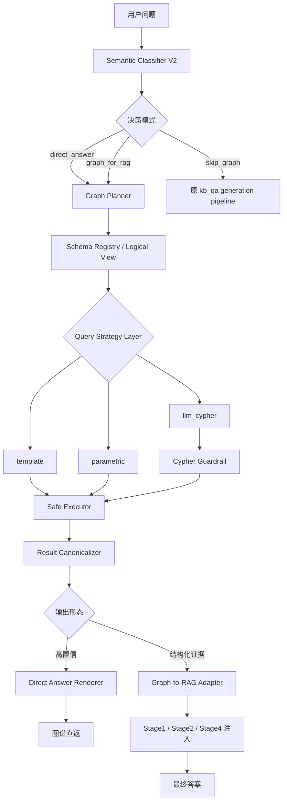
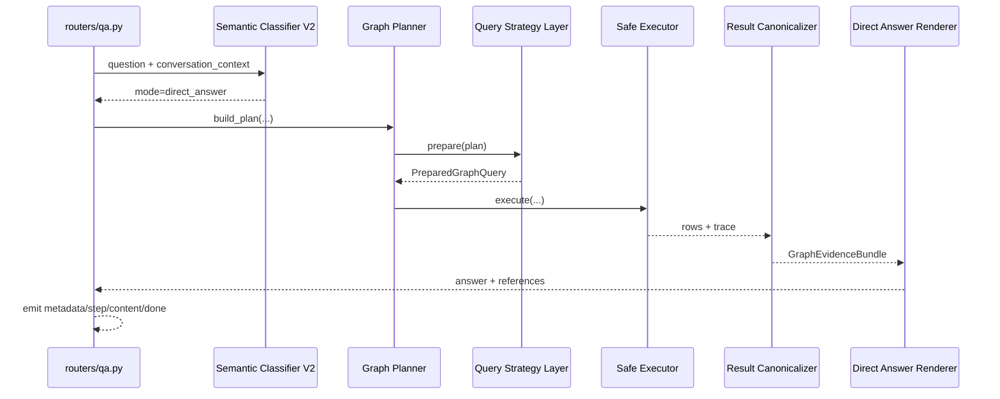
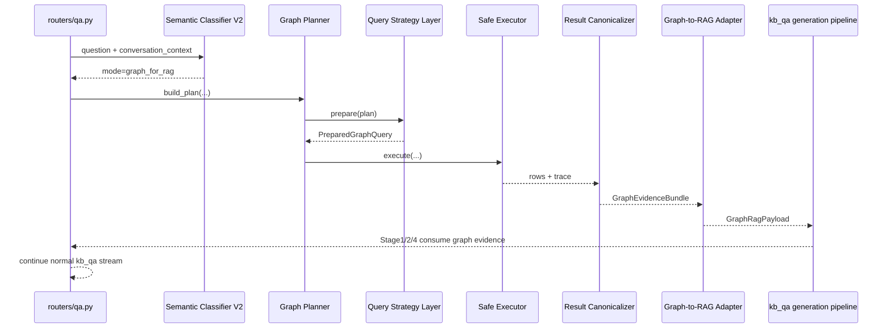

# fastQA graph_kb 升级 SPEC

## 1. 文档目的

本文档定义 `fastQA` 中 `graph_kb` 的目标升级方案，目标是在 **不重建现有 Neo4j 字段桶 schema** 的前提下，把当前“5 个硬编码模板的图谱快答器”升级为：

1. 可保留现有模板回退能力的图谱查询层
2. 具备三态决策能力的 graph 路由层
3. 可向 `kb_qa` generation pipeline 注入结构化 graph evidence 的证据层

本 SPEC 只描述架构、接口和实施路线，不包含代码实现。

## 2. 约束与现状

### 2.1 约束

1. 必须兼容现有 Neo4j 字段桶 schema，不重建图数据。
2. 不假设 Chroma 已存在，也不假设 `papers/{doi}.pdf` 或等价原文增强一定可用。
3. 必须保留当前 5 个模板的回退能力。
4. 新设计允许扩展到图谱 + 语义 + 原文三路，但当前版本以 graph 本身和 `kb_qa` 现有 generation pipeline 为主。

### 2.2 当前问题摘要

1. `classifier.py` 只有 `try_graph/skip` 二元决策，且正则过滤过宽。
2. `client.py` 只有 5 个硬编码模板，Cypher 固定，无法表达复杂约束。
3. 当前图谱是字段桶 schema，大量信息塞在 `name` 字符串中，不能按规范实体图假设扩展。
4. 现有路径对 `name` 关系方向有脆弱假设，存在“代码方向与 DB 实际方向相反”的风险。
5. `recipe`、`equipment`、`description`、`performance metrics` 等子图未被系统化利用。
6. `routers/qa.py` 中 `kb_qa` 分支目前只有“graph 直返”或“完全回退 generation”两种结果，中间缺少 `graph_for_rag` 模式。

## 3. 目标架构总览

升级后的 `graph_kb` 不是单独替代 `kb_qa`，而是作为 `kb_qa` 的前置图谱路由与证据层，输出三种模式：

1. `direct_answer`
   适合高置信、低歧义、可直接由 graph 回答的问题。
2. `graph_for_rag`
   graph 有结构化约束和 DOI/实体证据价值，但不适合单独回答，继续进入 Stage1/2/4。
3. `skip_graph`
   graph 价值低或风险高，直接走原 generation pipeline。

同时保留旧架构的四类思想，但调整输出形态：

1. `precise`
   通常映射到 `direct_answer` 或高置信 `graph_for_rag`
2. `hybrid`
   映射到 `graph_for_rag`
3. `community`
   当前版本优先映射到 `graph_for_rag`，后续扩展社区发现能力
4. `semantic`
   通常映射到 `skip_graph`



### 3.1 设计原则

1. planner 面向逻辑 schema，而不是直接面向底层 label/relation。
2. LLM 只在 `llm_cypher` 子策略中使用，且输入为逻辑计划而非原始用户问题。
3. 所有 Cypher 必须只读、白名单、有限复杂度、强制 `LIMIT`、受 timeout 约束。
4. 所有 graph 结果先 canonicalize，再决定直返还是注入 RAG。
5. graph evidence 只做结构化约束、候选和事实补充，不取代 PDF/原文证据。

## 4. 核心数据合同

以下类型为伪代码，仅用于明确接口边界。

```python
type GraphMode = Literal["direct_answer", "graph_for_rag", "skip_graph"]
type GraphFamily = Literal["precise", "hybrid", "community", "semantic"]
type QueryStrategy = Literal["template", "parametric", "llm_cypher"]
type GuardrailVerdict = Literal["allow", "rewrite", "reject"]

class GraphConstraint(TypedDict):
    field: str
    op: str
    value: str | int | float | bool

class GraphSort(TypedDict):
    field: str
    direction: Literal["asc", "desc"]

class PathCandidate(TypedDict):
    path_id: str
    description: str
    relation_chain: list[str]
    direction_mode: Literal["forward", "reverse", "bidirectional"]

class GraphFact(TypedDict):
    subject: str
    predicate: str
    object: str
    qualifiers: dict[str, str]
    doi: str | None
    source_path: str
    confidence: float

class GraphEvidenceBundle(TypedDict):
    papers: list[dict[str, str]]
    doi_candidates: list[str]
    entities: dict[str, list[str]]
    facts: list[GraphFact]
    render_slots: dict[str, Any]
    constraints_for_rag: list[GraphConstraint]
    diagnostics: dict[str, Any]
    direct_answerable: bool
    confidence: float
```

## 5. 核心组件设计

### 5.1 Semantic Classifier V2

#### 职责

1. 对问题进行三态决策：`direct_answer` / `graph_for_rag` / `skip_graph`。
2. 给出问题家族：`precise` / `hybrid` / `community` / `semantic`。
3. 判断是否需要利用对话上下文做 follow-up 解析。
4. 不再把“有文件上下文”简单等同于“禁用 graph”；此时优先降级为 `graph_for_rag`。

#### 输入

1. `question`
2. `conversation_context`
3. 可选 `source_selection`
4. 可选历史 graph diagnostics

#### 输出

```python
class SemanticDecision(TypedDict):
    mode: GraphMode
    family: GraphFamily
    intent: str
    direct_answer_score: float
    evidence_value_score: float
    requires_context_resolution: bool
    preserve_legacy_fallback: bool
    reasons: list[str]
```

#### 接口定义

```python
class SemanticClassifierV2(Protocol):
    def classify(
        self,
        *,
        question: str,
        conversation_context: dict[str, Any] | None,
    ) -> SemanticDecision:
        ...
```

#### 设计说明

1. 当前 5 模板可高置信命中的问题，优先落到 `direct_answer`。
2. “为什么/如何/机制/对比/趋势”默认不再直接 `skip`，而是优先评估是否适合 `graph_for_rag`。
3. “那篇/它/前者/后者”默认不再一刀切跳过，而是 `requires_context_resolution=True`。
4. `community` 家族在当前 schema 下不直接做社区回答，但允许输出“候选 DOI/实体簇”供 RAG 使用。

### 5.2 Schema Registry / Logical View

#### 职责

1. 为 planner 和 query builder 提供逻辑实体视图。
2. 记录字段桶 schema 到逻辑实体的映射，而不是改造底层图。
3. 记录候选路径、方向兜底、解析器、白名单字段和排序/过滤能力。

#### 输入

1. 人工维护的 registry 配置
2. 已验证的图谱路径和方向事实
3. 当前 5 模板和已有 Cypher 的实探知识

#### 输出

```python
class LogicalFieldSpec(TypedDict):
    field_id: str
    logical_entity: str
    anchor_labels: list[str]
    candidate_paths: list[PathCandidate]
    parser: str | None
    filter_ops: list[str]
    sortable: bool

class SchemaSummary(TypedDict):
    allowed_labels: list[str]
    allowed_relations: list[str]
    logical_entities: list[str]
    logical_fields: list[str]
```

#### 接口定义

```python
class SchemaRegistry(Protocol):
    def get_field(self, field_id: str) -> LogicalFieldSpec | None:
        ...

    def summarize_for_planner(self, *, intent: str) -> SchemaSummary:
        ...

    def summarize_for_llm(self, *, intent: str, max_fields: int = 20) -> str:
        ...
```

#### 建议的逻辑视图

1. `Paper`
   锚点为 `doi`、`title`
2. `RawMaterial`
   锚点为 `raw_materials`
3. `Process`
   锚点为 `process`、`preparation_method`、`process_steps`、`key_process_parameters`
4. `Recipe`
   锚点为 `recipe` 及其子字段
5. `Equipment`
   锚点为 `equipment`
6. `Testing`
   锚点为 `testing`
7. `PerformanceMetric`
   锚点为 `discharge_capacity`、`voltage`、`cycle`、`rate` 等字段桶
8. `Description`
   锚点为 `description`

### 5.3 Graph Planner

#### 职责

1. 把自然语言问题转换成逻辑查询计划，而不是直接生成 Cypher。
2. 选择最合适的查询策略：`template` / `parametric` / `llm_cypher`。
3. 约束 limit、字段需求、排序、路径候选和置信度。
4. 为保留旧模板回退提供显式 `legacy_template_id`。

#### 输入

1. `SemanticDecision`
2. `SchemaRegistry`
3. 可选 follow-up 解析后的实体锚点

#### 输出

```python
class GraphQueryPlanV2(TypedDict):
    mode: GraphMode
    family: GraphFamily
    intent: str
    strategy: QueryStrategy
    logical_targets: list[str]
    requested_fields: list[str]
    constraints: list[GraphConstraint]
    sorts: list[GraphSort]
    limit: int
    candidate_paths: list[PathCandidate]
    legacy_template_id: str | None
    confidence: float
```

#### 接口定义

```python
class GraphPlanner(Protocol):
    def build_plan(
        self,
        *,
        question: str,
        decision: SemanticDecision,
        conversation_context: dict[str, Any] | None,
        registry: SchemaRegistry,
    ) -> GraphQueryPlanV2 | None:
        ...
```

#### 规划规则

1. DOI 查标题/原料/工艺/测试等问题优先 `template`。
2. 单字段过滤、简单组合、路径可枚举的问题优先 `parametric`。
3. 只有当 `template` 和 `parametric` 都无法表达、且 registry 已给出安全摘要时，才使用 `llm_cypher`。
4. 当 planner 不确定时，必须保留 `legacy_template_id` 或直接返回 `graph_for_rag + low_confidence`，避免误直返。

### 5.4 Query Strategy Layer

#### 职责

1. 根据 `GraphQueryPlanV2` 分派查询策略。
2. 统一输出 `PreparedGraphQuery`，供 executor 消费。
3. 保留当前 5 模板作为稳定 fallback。

#### 输入

1. `GraphQueryPlanV2`
2. `SchemaRegistry`

#### 输出

```python
class PreparedGraphQuery(TypedDict):
    strategy: QueryStrategy
    cypher: str
    params: dict[str, Any]
    limit: int
    timeout_ms: int
    diagnostics: dict[str, Any]
```

#### 接口定义

```python
class QueryStrategyLayer(Protocol):
    def prepare(
        self,
        *,
        plan: GraphQueryPlanV2,
        registry: SchemaRegistry,
    ) -> PreparedGraphQuery | None:
        ...
```

#### 子策略

1. `template`
   继续使用并封装当前 5 个模板：
   `lookup_by_doi`、`expand_doi_context_by_doi`、`list_by_material`、`list_by_raw_material`、`count_by_filter`
2. `parametric`
   在逻辑字段上拼装受限查询，例如：
   DOI 锚点 + 指定字段展开、受限过滤、显式候选路径、多字段 `OPTIONAL MATCH`
3. `llm_cypher`
   仅接收逻辑计划、schema 摘要和白名单，不接收原始用户问题

#### 扩展点

为将来的“图谱 + 语义 + 原文”留出可选 provider，但默认不要求存在：

```python
class SemanticEvidenceProvider(Protocol):
    def search(
        self,
        *,
        query: str,
        doi_candidates: list[str],
        top_k: int,
    ) -> list[dict[str, Any]]:
        ...

class DocumentEvidenceProvider(Protocol):
    def fetch_snippets(
        self,
        *,
        dois: list[str],
        question: str,
        top_k_per_doi: int,
    ) -> dict[str, list[dict[str, Any]]]:
        ...
```

当前版本默认使用空实现，不依赖 Chroma 或 PDF。

### 5.5 Cypher Guardrail

#### 职责

1. 对 `llm_cypher` 产物做只读与复杂度校验。
2. 对轻微问题进行自动修正，例如补 `LIMIT`、替换非法字段、收紧 `RETURN`。
3. 对严重问题直接拒绝执行并回退。

#### 输入

1. `PreparedGraphQuery`
2. label/relation 白名单
3. 复杂度预算

#### 输出

```python
class GuardrailResult(TypedDict):
    verdict: GuardrailVerdict
    cypher: str
    params: dict[str, Any]
    issues: list[str]
    complexity_score: int
```

#### 接口定义

```python
class CypherGuardrail(Protocol):
    def inspect(
        self,
        *,
        query: PreparedGraphQuery,
        registry: SchemaRegistry,
    ) -> GuardrailResult:
        ...
```

#### 必查项

1. 只允许只读子句：`MATCH`、`OPTIONAL MATCH`、`WHERE`、`WITH`、`RETURN`、`ORDER BY`、`LIMIT`
2. 禁止写操作、schema 变更、任意 procedure、子查询泛滥
3. 必须命中白名单 label / relation
4. 必须强制 `LIMIT`
5. 必须满足复杂度预算与 timeout 预算

### 5.6 Safe Executor

#### 职责

1. 统一执行 template/parametric/llm_cypher 三类查询。
2. 处理 timeout、max_rows、路径尝试预算、关系方向回退。
3. 记录 path diagnostics，逐步沉淀 registry。

#### 输入

1. `PreparedGraphQuery`
2. `neo4j_client`
3. 执行配置

#### 输出

```python
class ExecutionTrace(TypedDict):
    strategy: QueryStrategy
    attempted_paths: list[str]
    matched_path: str | None
    latency_ms: float
    row_count: int
    fallback_reason: str | None

class RawExecutionResult(TypedDict):
    rows: list[dict[str, Any]]
    trace: ExecutionTrace
```

#### 接口定义

```python
class SafeExecutor(Protocol):
    def execute(
        self,
        *,
        prepared_query: PreparedGraphQuery,
        neo4j_client: Any,
        max_rows: int,
        timeout_ms: int,
        max_path_attempts: int = 3,
    ) -> RawExecutionResult:
        ...
```

#### 关键策略

1. 对 `name` 方向 bug 不做一次性硬编码，而是允许 path candidate 顺序尝试。
2. 每次尝试都记录 `attempted_paths`，便于后续固化 registry。
3. 一旦命中稳定路径，应优先把结果回写到 registry 配置，而不是继续膨胀执行侧条件分支。

### 5.7 Result Canonicalizer

#### 职责

1. 将底层字段桶结果整理为稳定的 `GraphEvidenceBundle`。
2. 统一提取 DOI、标题、原料、工艺、配方、设备、测试项、性能指标。
3. 将 `name` 字符串解析逻辑从 renderer 中抽离为可复用 canonicalizer 规则。

#### 输入

1. `GraphQueryPlanV2`
2. `RawExecutionResult`
3. `SchemaRegistry`

#### 输出

1. `GraphEvidenceBundle`

#### 接口定义

```python
class ResultCanonicalizer(Protocol):
    def canonicalize(
        self,
        *,
        plan: GraphQueryPlanV2,
        execution_result: RawExecutionResult,
        registry: SchemaRegistry,
    ) -> GraphEvidenceBundle:
        ...
```

#### 设计说明

1. `render_slots` 用于直返渲染，例如标题、DOI、匹配原料、测试项、工艺参数。
2. `facts` 用于 Stage4 结构化注入。
3. `constraints_for_rag` 用于 Stage2 约束和 DOI 锚定。
4. 所有输出字段必须允许为空，空 bundle 不视为异常，但会影响 routing。

### 5.8 Direct Answer Renderer

#### 职责

1. 只对高置信、低歧义场景生成图谱直返。
2. 把 `GraphEvidenceBundle` 渲染为前端可直接展示的最终答案与 references。
3. 保持当前 5 模板的输出可回退到旧 renderer。

#### 输入

1. `GraphEvidenceBundle`
2. `GraphQueryPlanV2`
3. `SemanticDecision`

#### 输出

```python
class DirectAnswerResult(TypedDict):
    handled: bool
    answer: str
    references: list[str]
    query_mode: str
    render_reason: str
```

#### 接口定义

```python
class DirectAnswerRenderer(Protocol):
    def render(
        self,
        *,
        decision: SemanticDecision,
        plan: GraphQueryPlanV2,
        bundle: GraphEvidenceBundle,
    ) -> DirectAnswerResult:
        ...
```

#### 适合直返的典型场景

1. DOI 查标题、工艺、测试、原料
2. 简单文献列表
3. 简单原料列表
4. 简单计数
5. 单文献单字段展开

#### 默认不直返的场景

1. 多条件比较
2. 多文献归纳
3. 为什么/如何/哪个更好
4. 需要原文证据兜底的高解释性回答

### 5.9 Graph-to-RAG Adapter

#### 职责

1. 把 graph 结果转换成 Stage1/2/4 可消费的 evidence payload。
2. 统一管理 graph 对 generation pipeline 的注入位置和格式。
3. 为未来可选的语义检索和原文检索接口保留扩展位，但默认不依赖它们存在。

#### 输入

1. `GraphEvidenceBundle`
2. `SemanticDecision`
3. `GraphQueryPlanV2`

#### 输出

```python
class GraphRagPayload(TypedDict):
    stage1_context_block: str
    stage2_doi_candidates: list[str]
    stage2_constraints: list[GraphConstraint]
    stage2_entity_hints: dict[str, list[str]]
    stage4_fact_block: str
    cache_fingerprint: str
    optional_semantic_query: str | None
    optional_document_requests: list[dict[str, Any]]
```

#### 接口定义

```python
class GraphToRagAdapter(Protocol):
    def build_payload(
        self,
        *,
        decision: SemanticDecision,
        plan: GraphQueryPlanV2,
        bundle: GraphEvidenceBundle,
    ) -> GraphRagPayload:
        ...
```

#### 设计原则

1. graph 优先提供约束、候选 DOI、结构化事实，不替代原文证据。
2. 如果没有语义 provider 或 document provider，则对应字段为空，不影响主链路。
3. `graph_for_rag` 模式下，只要 graph evidence 有价值，即使不足以直返，也应进入 Stage1/2/4。
4. `cache_fingerprint` 必须是稳定可序列化摘要，用于 Stage1/Stage2 cache key 隔离。

## 6. 数据流设计

### 6.1 直返模式



### 6.2 graph_for_rag 模式



## 7. 与现有 fastQA 的集成点

### 7.1 `routers/qa.py` 中 `kb_qa` 分支改造

当前逻辑是：

1. `try_graph_kb_answer(...)`
2. `handled=True` 则直返
3. 否则直接走 `qa_kb_service.iter_answer_events(...)`

目标改造为：

```python
class GraphRoutingResult(TypedDict):
    mode: GraphMode
    direct_result: DirectAnswerResult | None
    rag_payload: GraphRagPayload | None
    diagnostics: dict[str, Any]
```

```python
def run_graph_kb_v2(
    *,
    question: str,
    conversation_context: dict[str, Any] | None,
    neo4j_client: Any,
    generation_runtime: Any | None,
    settings: Any,
) -> GraphRoutingResult:
    ...
```

`kb_qa` 分支行为调整为：

1. `mode=direct_answer`
   复用现有 graph SSE 事件风格，直接结束请求
2. `mode=graph_for_rag`
   构造 `QaKbRequest` 时附带 `graph_evidence`
3. `mode=skip_graph`
   保持现有 generation pipeline 行为

本 SPEC 在实现上明确采用 **单一路由载体模型**：

1. `graph evidence` 不嵌入 `conversation_context`
2. `graph evidence` 作为 `QaKbRequest.graph_evidence` 顶层字段单独传递
3. `QaKbService.iter_answer_events()`、`GenerationPipelineOrchestrator.run()/stream()`、`GenerationRuntime` protocol、`generation_driven_rag_facade.py` 必须显式接收并透传该字段

原因：

1. 当前 `QaKbService.iter_answer_events()` 会重建 `conversation_context`，只保留 `recent_turns_for_llm / summary_for_llm / conversation_state / source_selection`
2. 若把 graph payload 塞进 `conversation_context`，容易在 normalize 流程中被裁剪、误归类，或和会话摘要语义混淆
3. graph evidence 更接近一次请求内的结构化检索上下文，而不是长期对话记忆

建议的数据合同如下：

```python
class QaKbRequest(TypedDict):
    question: str
    request_use_generation_driven: bool
    route_hint: str
    n_results_per_claim: int
    active_stream_count: int | None
    trace_id: str
    recent_turns_for_llm: list[dict[str, Any]]
    summary_for_llm: dict[str, Any]
    conversation_state: dict[str, Any]
    source_selection: dict[str, Any]
    graph_evidence: GraphRagPayload | None
```

```python
class GenerationRuntime(Protocol):
    def stage1_pre_answer_and_planning(
        self,
        user_question: str,
        conversation_context: dict[str, Any] | None = None,
        graph_context: str | None = None,
    ) -> dict[str, Any]:
        ...

    def stage2_targeted_retrieval(
        self,
        retrieval_claims: list[dict[str, Any]],
        n_results_per_claim: int = 10,
        user_question: str | None = None,
        should_cancel: Any | None = None,
        active_stream_count: int | None = None,
        doi_candidates: list[str] | None = None,
        graph_constraints: list[GraphConstraint] | None = None,
        entity_hints: dict[str, list[str]] | None = None,
    ) -> dict[str, Any]:
        ...

    def stage4_synthesis_with_pdf_chunks(
        self,
        user_question: str,
        deep_answer: str,
        pdf_chunks: dict[str, list[dict[str, Any]]],
        retrieval_results: dict[str, Any] | None = None,
        should_cancel: Any | None = None,
        conversation_context: dict[str, Any] | None = None,
        graph_fact_block: str | None = None,
    ) -> Any:
        ...
```

### 7.2 Stage1 接收 graph evidence

当前 `Stage1Planner.run()` 最终调用：

```python
runtime.stage1_pre_answer_and_planning(
    user_question,
    conversation_context=conversation_context,
)
```

建议扩展为：

```python
runtime.stage1_pre_answer_and_planning(
    user_question,
    conversation_context=conversation_context,
    graph_context=graph_payload.stage1_context_block,
)
```

作用：

1. 帮助 `deep_answer` 锚定正确 DOI/实体
2. 帮助 `retrieval_claims` 更聚焦
3. 避免 Stage1 在材料名、工艺名、性能字段上漂移

兼容策略：

1. 如果 runtime 还不支持 `graph_context` 参数，wrapper 先做签名探测或降级为空
2. `graph_context` 为空时，行为必须与当前一致
3. `QaKbService` 和 orchestrator 不得把 `graph_context` 回写进 `conversation_context`

### 7.3 Stage2 接收 graph evidence

当前 `Stage2Retriever.run()` 最终调用：

```python
runtime.stage2_targeted_retrieval(
    retrieval_claims=retrieval_claims,
    n_results_per_claim=n_results_per_claim,
    user_question=user_question,
    should_cancel=should_cancel,
    active_stream_count=active_stream_count,
)
```

建议扩展为：

```python
runtime.stage2_targeted_retrieval(
    retrieval_claims=retrieval_claims,
    n_results_per_claim=n_results_per_claim,
    user_question=user_question,
    should_cancel=should_cancel,
    active_stream_count=active_stream_count,
    doi_candidates=graph_payload.stage2_doi_candidates,
    graph_constraints=graph_payload.stage2_constraints,
    entity_hints=graph_payload.stage2_entity_hints,
)
```

作用：

1. 让 Stage2 更早收紧 DOI 候选范围
2. 锁定关键实体，减少语义检索跑偏
3. 为未来接入可选的 semantic provider 留接口

兼容策略：

1. 无法改 runtime 时，可先在 Stage2 wrapper 内把 graph hints 合并为约束提示
2. 缺省值必须为空列表/空字典
3. `generation_driven_rag_facade.py` 的真实 runtime 签名必须同步扩展，否则 wrapper 层只会“声明支持”但无法实际透传

### 7.4 Stage4 接收 graph evidence

当前 `Stage4Synthesizer.stream()` 最终调用：

```python
runtime.stage4_synthesis_with_pdf_chunks(
    user_question=user_question,
    deep_answer=deep_answer,
    pdf_chunks=pdf_chunks,
    retrieval_results=retrieval_results,
    should_cancel=should_cancel,
    conversation_context=conversation_context,
)
```

建议扩展为：

```python
runtime.stage4_synthesis_with_pdf_chunks(
    user_question=user_question,
    deep_answer=deep_answer,
    pdf_chunks=pdf_chunks,
    retrieval_results=retrieval_results,
    should_cancel=should_cancel,
    conversation_context=conversation_context,
    graph_fact_block=graph_payload.stage4_fact_block,
)
```

作用：

1. 提供 DOI 锚定与参数标准化
2. 在原文片段不足时补充结构化 graph facts
3. 做实体一致性校验，而不是取代原文引用

兼容策略：

1. `graph_fact_block` 缺省为空字符串
2. Stage4 prompt 中必须把 graph facts 标记为“结构化补充证据”，避免其覆盖 PDF 引用

### 7.5 cache 与无 DOI fallback 约束

#### 7.5.1 cache key 约束

当前 `kb_qa` orchestrator 中：

1. Stage1 先缓存再继续
2. Stage2 先缓存再继续
3. 现有 cache key 不包含未来的 graph payload

因此 V2 必须显式规定 cache 版本与 hash 策略：

```python
class GraphCacheMaterial(TypedDict):
    stage1_graph_hash: str
    stage2_graph_hash: str
```

要求：

1. Stage1 cache key 必须纳入 `graph_payload.cache_fingerprint` 或等价 `stage1_graph_hash`
2. Stage2 cache key 必须纳入 `graph_payload.cache_fingerprint`，或拆分后的 `doi_candidates/constraints/entity_hints` hash
3. 如果 graph payload 为空，hash 固定为 `"none"`，保证与当前行为兼容
4. 如需快速回退，可通过显式版本号或 epoch 一次性失效旧 cache

建议实现边界：

1. `app/modules/qa_cache/stage1_cache.py`
2. `app/modules/qa_cache/stage2_cache.py`
3. `app/modules/qa_kb/orchestrators/generation.py`

#### 7.5.2 Stage2 仍无 DOI 的 fallback 规则

当前 orchestrator 在“Stage2 无 DOI”时会提前回退到 Stage1-only 输出。V2 需要把 `graph_for_rag` 的 no-DOI 分支写清楚：

1. 如果 Stage2 无 DOI 且 `graph_payload.stage2_doi_candidates` 非空：
   使用 top-N graph DOI candidates 进入 `graph_seeded_doi_fallback`
2. `graph_seeded_doi_fallback` 下允许：
   直接把 graph DOI 列表作为 `dois` 继续进入 Stage25 / Stage3 / Stage4
3. 此时 metadata 或 diagnostics 必须标记：
   `doi_source = "graph_seeded"`
4. 如果 Stage2 无 DOI 且 graph 也无 DOI candidates：
   才退回当前的 Stage1-only fallback

这个规则的目标不是让 graph 取代 retrieval ranking，而是在语义检索失手时，允许 graph_for_rag 继续提供最小可用证据路径。

### 7.6 feature flag 分层开关

建议使用分层开关，而不是单一总开关：

| Flag | 作用 |
| --- | --- |
| `FASTQA_GRAPH_KB_V2_ENABLED` | 启用新 graph_kb 执行入口 |
| `FASTQA_GRAPH_KB_CLASSIFIER_V2_ENABLED` | 启用三态 classifier |
| `FASTQA_GRAPH_KB_SCHEMA_REGISTRY_ENABLED` | 启用逻辑 schema registry |
| `FASTQA_GRAPH_KB_PARAMETRIC_ENABLED` | 启用 parametric query |
| `FASTQA_GRAPH_KB_LLM_CYPHER_ENABLED` | 启用 guarded llm_cypher |
| `FASTQA_GRAPH_KB_RAG_INJECTION_ENABLED` | 启用 graph_for_rag 注入 |
| `FASTQA_GRAPH_KB_LEGACY_TEMPLATE_FALLBACK_ENABLED` | 启用旧 5 模板回退 |
| `FASTQA_GRAPH_KB_DIAGNOSTICS_ENABLED` | 启用查询与路径诊断输出 |
| `QA_STAGE1_GRAPH_CACHE_VERSION` | Stage1 graph payload cache 版本 |
| `QA_STAGE2_GRAPH_CACHE_VERSION` | Stage2 graph payload cache 版本 |

设计要求：

1. 所有开关关闭时，行为必须退化为当前实现。
2. `LLM_CYPHER` 与 `RAG_INJECTION` 必须可独立关闭。
3. legacy template fallback 默认开启，直到 V2 稳定。

## 8. 分阶段实施路线

### Phase 0：可观测性与基线固化

#### 目标

建立当前 graph_kb 的真实行为基线，避免后续升级无对照。

#### 输入

1. 现有 `graph_kb` 代码
2. 现有 5 模板问题集
3. 已知 schema 差距和方向 bug 样例

#### 输出

1. graph 命中率、空结果率、fallback 率、timeout 率基线
2. 一份离线回归问题集
3. 路径方向问题和空结果问题的诊断样本

#### 修改范围

1. `app/modules/graph_kb/` 诊断日志
2. 离线样例集和评测脚本

#### 回退策略

纯观测层开关，随时可关闭，不影响主链路。

### Phase 1：Schema Registry 与 Canonical Model

#### 目标

把现有字段桶知识和字符串解析从散落逻辑中抽出，形成可复用逻辑层。

#### 输入

1. Phase 0 的路径诊断
2. 当前 5 模板与现有 renderer 的解析规则
3. `recipe`、`equipment`、`description`、`performance metrics` 子图清单

#### 输出

1. `SchemaRegistry`
2. `GraphQueryPlanV2` 与 `GraphEvidenceBundle` 数据合同
3. 可复用的 canonicalizer 解析规则

#### 修改范围

1. `app/modules/graph_kb/` 新增 schema/normalizer/model 边界
2. 旧 renderer 逐步迁移到 canonical model

#### 回退策略

canonicalizer 失败时继续走旧 `render_graph_kb_answer()`。

### Phase 2：Semantic Classifier V2 与 Planner V2

#### 目标

把二元正则决策升级为三态决策和逻辑计划。

#### 输入

1. Phase 0 回归问题集
2. Phase 1 registry
3. 当前 `conversation_context` 结构

#### 输出

1. `SemanticDecision`
2. `GraphQueryPlanV2`
3. 对 follow-up、文件上下文、broad semantic 的新路由策略

#### 修改范围

1. `classifier.py` 或其 V2 替代模块
2. `client.py` 中 plan 逻辑拆分
3. `routers/qa.py` 与 graph 入口返回值契约

#### 回退策略

1. classifier V2 可按 flag 关闭
2. planner 失败时保留旧 5 模板 planner

### Phase 3：Query Strategy Layer、Guardrail 与 Safe Executor

#### 目标

建立 template/parametric/llm_cypher 三层查询能力，并把执行风险收口到 guardrail 与 executor。

#### 输入

1. Phase 2 的逻辑计划
2. registry 白名单
3. 执行预算与 timeout 预算

#### 输出

1. `QueryStrategyLayer`
2. `CypherGuardrail`
3. `SafeExecutor`
4. 关系方向 fallback 和 path diagnostics

#### 修改范围

1. `client.py` 拆分为 planner/builder/executor/guardrail
2. runtime settings 增加 V2 flag

#### 回退策略

1. 优先 `template -> parametric`，`llm_cypher` 单独 flag
2. guardrail `reject` 时回退到 parametric 或 legacy template
3. executor 超时或空结果时保留原 fallback 行为

### Phase 4：Graph-to-RAG Integration

#### 目标

让 graph 在非直返场景下成为 `kb_qa` 的结构化证据源。

#### 输入

1. `GraphEvidenceBundle`
2. `QaKbRequest` / `GenerationRuntime` 现有接口
3. Stage1/2/4 的 prompt 与 wrapper

#### 输出

1. `GraphRagPayload`
2. Stage1 graph context block
3. Stage2 DOI/entity/constraint 注入
4. Stage4 graph fact block

#### 修改范围

1. `app/routers/qa.py`
2. `app/modules/qa_kb/models.py`
3. `app/modules/qa_kb/service.py`
4. `app/modules/qa_kb/orchestrators/generation.py`
5. `app/modules/qa_kb/stages/planning.py`
6. `app/modules/qa_kb/stages/retrieval.py`
7. `app/modules/qa_kb/stages/synthesis.py`
8. `app/modules/generation_pipeline/generation_driven_rag_facade.py`
9. `app/modules/qa_cache/stage1_cache.py`
10. `app/modules/qa_cache/stage2_cache.py`

#### 回退策略

1. `FASTQA_GRAPH_KB_RAG_INJECTION_ENABLED=0` 时直接退回原 generation pipeline
2. 任一 Stage 注入失败时只丢弃 graph payload，不阻断主问答
3. cache 兼容异常时，可通过 graph cache version / epoch 直接失效相关 key

### Phase 5：评测、灰度与收敛

#### 目标

形成可长期维护的上线策略、监控指标和收敛机制。

#### 输入

1. 全量 feature flags
2. Phase 0 回归样例
3. 新增 graph_for_rag 样例集

#### 输出

1. 回归报告
2. 灰度发布策略
3. registry 修正闭环
4. legacy template 退场条件

#### 修改范围

1. metrics / dashboard
2. rollout 配置
3. 回归测试与压测脚本

#### 回退策略

任一阶段均可独立回退到：

1. 旧 graph 模板直返
2. 纯 generation-driven `kb_qa`

## 9. 风险

### 9.1 架构风险

1. 字段桶 schema 与 `name` 拼接值会限制 planner 与 llm_cypher 的稳定性。
2. `name` 方向 bug 若未被 registry + executor 正式收口，会持续制造“伪空结果”。
3. 如果把 graph facts 过度注入 Stage1/4，可能污染回答而不是约束回答。
4. 多 path fallback 可能带来明显延迟上升。
5. 过早启用 `llm_cypher` 会放大低命中和安全风险。
6. 若 cache key 未纳入 graph payload，可能命中陈旧的无图结果。

### 9.2 风险控制

1. 默认顺序固定为 `template -> parametric -> llm_cypher`。
2. `llm_cypher` 只能消费逻辑计划和 schema 摘要，不能直接消费原始问题。
3. graph 注入默认只做候选 DOI、实体锁定、事实补充，不取代文献引用。
4. 对 path fallback 设预算和诊断输出，不允许无限尝试。
5. legacy template fallback 保持开启，直到 V2 回归稳定。
6. Stage1/Stage2 cache key 必须以 graph payload hash 隔离，否则禁止启用 `graph_for_rag`。

## 10. 验收标准

### 10.1 功能验收

1. 旧 5 模板场景在开启 V2 后仍可回答，且允许通过 legacy fallback 达到与当前相同或更好的结果。
2. `kb_qa` 能区分 `direct_answer`、`graph_for_rag`、`skip_graph` 三种模式。
3. Stage1/2/4 至少能接受空兼容的 graph payload，不破坏现有调用链。
4. 无 Chroma、无 PDF 的情况下，`graph_for_rag` 仍能通过 graph context 与 DOI constraints 提供价值。
5. `QaKbRequest -> QaKbService -> orchestrator -> runtime facade` 的 graph payload 透传链必须闭合，不得在 normalize 过程中丢失。

### 10.2 安全验收

1. 所有 llm 生成的 Cypher 必须经过 guardrail。
2. 不允许执行任何写操作、schema 变更或未注册 procedure。
3. 所有执行路径必须强制 `LIMIT` 并受 timeout 约束。

### 10.3 回退验收

1. 关闭 `FASTQA_GRAPH_KB_V2_ENABLED` 后，行为回到当前实现。
2. 关闭 `FASTQA_GRAPH_KB_RAG_INJECTION_ENABLED` 后，Stage1/2/4 恢复原样。
3. 关闭 `FASTQA_GRAPH_KB_LLM_CYPHER_ENABLED` 后，仍能保留 template 与 parametric 路径。
4. 清空 graph cache version / epoch 后，不得再命中老的无图 cache。

### 10.4 质量验收

1. 旧模板回归集无明显退化。
2. `graph_for_rag` 样例中，graph evidence 注入后应提升 DOI 锚定和实体一致性。
3. graph 失败、空结果、guardrail reject、timeout 场景下，`kb_qa` 仍可稳定回退 generation pipeline。
4. graph 查询附加延迟必须受配置预算控制，不能拖垮主链路。
5. Stage2 无 DOI 但 graph 有 DOI candidates 的样例中，必须触发 `graph_seeded_doi_fallback`，而不是提前退回 Stage1-only。

## 11. 结论

推荐把 `graph_kb` 从当前“二元路由 + 5 个模板的直返快答器”升级为“**三态 graph 查询层 + graph evidence adapter**”：

1. 高置信场景继续低延迟直返
2. 中等置信但高证据价值场景转入 `graph_for_rag`
3. 低价值或高风险场景继续 `skip_graph`

在不重建 Neo4j 图数据、也不预设 Chroma/PDF 一定可用的前提下，这一路线兼顾了现实约束、渐进演进和未来扩展性。
