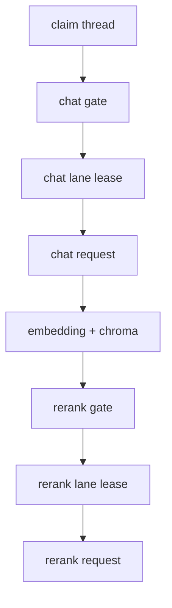

# fastQA Stage2 DashScope 热连接优化方案

## 1. 文档目的

本文档定义 `fastQA` 在 **不更换模型、不更换 rerank 策略、不改变 Stage2 claim 结构** 的前提下，对 DashScope 上游调用链路进行热连接优化的方案。

目标是解决当前 `stage2` 的核心性能问题：

1. `AI query generation` 在 5 个 claim 并发场景下，通常只有 1 个 claim 很快，其余 4 个 claim 会落入极慢路径
2. `rerank` 当前没有共享会话复用，且在冷路径下也表现出极高延迟
3. 现有 `shared_llm_http_pool` 只能保证“共享一个连接池”，不能保证“稳定命中 5 条已热连接”
4. `stage2` 当前没有根据热连接可用数量进行本地门控，容易让 5 个 claim 同时触发冷连接拨号

本文档只做设计，不包含代码修改。

---

## 2. 背景与实测证据

### 2.1 当前 `stage2` 实测表现

2026-04-22 对 `fastQA` 最新日志的观测结果如下：

- `stage2` 总耗时约 `71s - 72s`
- `retrieval_claims = 5`
- `pool_wait_ms = 0.0`
- `stage2 semantic search timing` 显示：
  - `embedding_ms` 通常在 `38ms - 96ms`
  - `chroma_query_ms` 通常在 `10ms - 18ms`
  - `rerank_ms` 稳定在 `40.2s - 40.4s`
- `stage2 claim timing` 显示：
  - 1 个 claim 的 `ai_query_ms` 约 `1.2s - 1.3s`
  - 其余 4 个 claim 的 `ai_query_ms` 约 `31.2s - 31.6s`

由此可得：

- `embedding` 与 `Chroma` 不是主要瓶颈
- 主要耗时集中在：
  - `AI query generation`
  - `rerank`

### 2.2 直接调用 DashScope 的会话复用实测

2026-04-22 在相同环境中，对 DashScope 做了顺序直连实验。

#### A. `chat/completions`，不显式复用会话

- 第 1 次：约 `180.9s`
- 第 2 次：约 `180.9s`
- 第 3 次：约 `181.3s`

#### B. `chat/completions`，显式复用同一个 `requests.Session()`

- 第 1 次：约 `269.2s`
- 第 2 次：约 `1.05s`
- 第 3 次：约 `0.58s`
- 第 4 次：约 `0.65s`
- 第 5 次：约 `0.68s`

#### C. `rerank`，显式复用同一个 `requests.Session()`

- 第 1 次：约 `270.1s`
- 第 2 次：约 `124ms`
- 第 3 次：约 `125ms`
- 第 4 次：约 `135ms`
- 第 5 次：约 `104ms`

### 2.3 结论

上述实测说明：

1. 问题不能简单理解为“TCP 三次握手本身很慢”
2. 实际上是 **冷连接路径极慢，热连接路径极快**
3. 当前 `stage2` 的 5-claim 并发模型非常依赖“是否能稳定命中 5 条热连接”
4. 单纯增加 `max_connections` 不能解决问题，因为它只增加容量，不保证已热 lane 的数量

---

## 3. 当前架构的结构性缺陷

### 3.1 现有 `shared_llm_http_pool` 是通用池，不是热 lane 池

当前 `fastQA` 已经有：

- `FastQASharedUpstreamHttpPool`
- 每个 worker 一个共享 `httpx.Client`
- `max_connections=160`
- `max_keepalive_connections=64`
- `keepalive_expiry_seconds=90`

这套设计能解决：

- 重复创建 client
- worker 内部共享 transport
- 避免明显的连接池容量不足

但不能解决：

- “恰好有 5 条已热连接可供 Stage2 5 个 claim 并发复用”
- “一旦需要新建连接，是否会落入极慢冷路径”

### 3.2 `rerank` 当前没有共享会话池

当前 `rerank` 通过 [`rerank_service.py`](/home/cqy/worktrees/highThinking/fastQA/app/modules/generation_pipeline/rerank_service.py) 直接 `requests.post(...)` 访问 DashScope。

这意味着：

- 没有 `requests.Session()` 复用
- 没有热连接保温
- 没有 lane 级健康状态
- 没有任何针对冷连接路径的控制能力

### 3.3 Stage2 没有“按热 lane 数量门控”

当前 `stage2` 的 claim 并发由：

- `QA_STAGE2_PARALLEL_WORKERS`

控制，默认 `5`。

但 `stage2` 不知道：

- 当前 chat 热连接 ready 数量是多少
- 当前 rerank 热连接 ready 数量是多少
- 是否应该把对上游的真实并发门控到 ready lane 数量以内

结果就是：

- claim 线程数 = 5
- 上游实际冷连接拨号数也可能接近 5
- provider 侧冷路径被同时触发

---

## 4. 设计目标

### 4.1 目标

1. 在每个 `gunicorn worker` 内，为 Stage2 构建 **稳定的热连接 lane 池**
2. 为 `AI query generation` 和 `rerank` 分别建立独立的热会话管理
3. 保持现有模型、prompt、rerank 策略不变
4. 引入保温机制，避免 lane 在低流量下重新回冷
5. 让 Stage2 上游真实并发受 hot lane 可用数量约束
6. 失败时可无损回退到当前实现

### 4.2 非目标

1. 不更换 `deepseek-v3.1`
2. 不更换 `qwen3-vl-rerank`
3. 不调整 rerank candidate 数量与策略
4. 不重写 Stage2 业务逻辑
5. 不尝试在多个 worker 之间共享同一个连接池

---

## 5. 方案对比

### 5.1 方案 A：仅增大现有 `max_connections`

思路：

- 继续沿用现有 `shared_llm_http_pool`
- 只上调 `max_connections` / `max_keepalive_connections`

优点：

- 改动小
- 低风险

缺点：

- 不能保证 5 条已热连接
- 不能解决 rerank 完全没有 session 复用的问题
- 无法控制冷连接风暴

结论：不推荐作为主方案

### 5.2 方案 B：把 Stage2 全部改成串行

思路：

- 让 5 个 claim 不再并发，而是顺序执行

优点：

- 极大增加热连接复用概率
- 实现最简单

缺点：

- 破坏当前 Stage2 的并发结构
- 峰值吞吐下降明显
- 在已有 5 条热 lane 时会浪费并行能力

结论：只适合作为兜底或门控退化模式，不适合作为主路径

### 5.3 方案 C：推荐方案，热 lane 池 + keepalive + 本地并发门控

思路：

- 保留 Stage2 的 5-claim 结构
- 为 chat 和 rerank 分别引入 worker 内 hot lane 池
- lane 启动时预热，运行中保温
- Stage2 的真实上游并发由 ready lane 数量门控

优点：

- 不改业务语义
- 直接针对“冷连接慢、热连接快”问题
- 能覆盖 chat 与 rerank 两条链路

缺点：

- 实现复杂度高于简单共享池
- 每个 worker 将持有更多常驻上游连接

结论：推荐采用

---

## 6. 推荐架构

### 6.1 总体结构

```mermaid
flowchart LR
    Q[用户问题] --> S1[Stage1]
    S1 --> S2[Stage2 Claim Threads]

    S2 --> G1[AI Query Generation Gate]
    G1 --> CPOOL[Chat Hot Lane Pool]
    CPOOL --> CHAT[DashScope chat/completions]

    S2 --> RETR[Embedding + Chroma]

    RETR --> G2[Rerank Gate]
    G2 --> RPOOL[Rerank Hot Session Pool]
    RPOOL --> RERANK[DashScope rerank API]

    CHAT --> RETR
    RERANK --> VAL[Relevance Validation]
    VAL --> S25[Stage25]
```

### 6.2 设计原则

1. **保留现有 generic shared pool**
   - Stage1 / Stage4 继续使用现有 `shared_llm_http_pool`
   - Stage2 新增专用 hot lane 管理，不替换现有通用池

2. **Chat 与 rerank 分池**
   - 两者是不同 endpoint，不共享 lane
   - 各自维护健康、保温、并发门控

3. **每个 lane 绑定自己的独占会话对象**
   - Chat lane：独立 `httpx.Client` + 基于该 client 构造的 `OpenAICompatClient`
   - Rerank lane：独立 `requests.Session`
   - 单个 lane 在任一时刻只允许 `1` 个 in-flight request，必须以 lease/release 语义独占使用

4. **lane 数量是 rollout 参数，不是既定真理**
   - 当前 `retrieval_claims` 常见上限是 `5`
   - 但 hot lane 初始默认值应保守，建议从 `3` 起步
   - 观测稳定后，再按 worker 数量与 provider 表现逐步上调到 `5`

5. **门控的是“外部上游调用”，不是 claim 线程本身**
   - claim 线程仍可保留 5
   - 但发起 chat / rerank 时必须先拿 gate 令牌

6. **热连接存活 contract 必须写在 hot pool 自身**
   - Chat hot lane 必须显式配置自己的 `keepalive_expiry_seconds`
   - 必须满足 `keepalive_expiry_seconds > warm_interval_seconds`
   - 推荐满足 `keepalive_expiry_seconds >= max(2 * warm_interval_seconds, 900)`

7. **零 ready lane 时必须 fail-open**
   - `ready_lanes == 0` 不能把 gate limit 算成 `0` 后卡死主链路
   - 此时应直接 bypass gate，并回退到当前实现

---

## 7. 关键组件设计

### 7.1 Chat Hot Lane Pool

职责：

- 为 `AI query generation` 提供 worker 内可配置的热 lane
- 每个 lane 对外暴露与现有 Stage2 兼容的 `client.chat.completions.create(...)` 调用面
- 每个 lane 预期长期维持 1 条热 TCP/TLS 连接

建议实现要点：

- 每个 lane 底层使用：
  - `max_connections=1`
  - `max_keepalive_connections=1`
  - `http2=False`
- 每个 lane 通过现有 `build_chat_completions_client(...)` 构造 compat client：
  - 只替换底层 `http_client`
  - 不改变 Stage2 上层调用方式
- 使用与当前生产一致的：
  - `base_url`
  - `api_key`
  - `model=deepseek-v3.1`
- 每个 lane 自己持有：
  - `keepalive_expiry_seconds`
  - `warm_interval_seconds`
  - `warm_timeout_seconds`
- warm-up payload 使用同模型、极小 token、极小 prompt
- 关键 API：
  - `lease_lane(trace_label=...) -> context manager yielding lane handle or None`
  - `warm_lane(lane_id)`
  - `snapshot()`
  - `close()`
- `lease_lane(...)` 语义：
  - context manager 始终可进入
  - 上下文体内要么拿到独占 lane handle，要么拿到 `None`
  - lane handle 退出上下文时必须自动 release
  - `in_flight` 只能是 `0/1`
  - 如果当前没有 ready lane，则 yield `None`，由调用方 fail-open 回退
- lane 元数据：
  - `lane_id`
  - `state = cold/warming/ready/degraded`
  - `last_warm_success_at`
  - `last_error_summary`
  - `in_flight`
  - `consecutive_failures`

### 7.2 Rerank Hot Session Pool

职责：

- 为 `rerank` 提供 worker 内热 session lane

建议实现要点：

- 使用 `requests.Session()`，保持与现有 `rerank_service.py` 最小语义差异
- 每个 lane 一个 `Session`
- 使用与 chat lane 相同的 lease/release 语义：
  - `lease_lane(trace_label=...) -> context manager`
  - 单 lane 同时只允许一个请求占用
- warm-up 请求同样走真实 `qwen3-vl-rerank` endpoint
- payload 极小：
  - 1 条 query
  - 2 条极短 document

为什么先用 `requests.Session()`：

- 当前 rerank 逻辑已经基于 `requests`
- 风险更低，迁移成本更小
- 长期可评估统一到 `httpx`

### 7.3 与现有代码边界的兼容

当前代码边界不是“Stage2 直接持有 `httpx.Client`”，而是：

- chat 路径使用 `client.chat.completions.create(...)`
- rerank 路径由 `MicroscopicSemanticExpert._rerank_documents(...)` 间接调用 `rerank_service.py`

因此新方案必须沿现有边界接入：

- chat hot lane：
  - lane 内部可以持有独立 `httpx.Client`
  - 但对外必须暴露 `OpenAICompatClient`
  - Stage2 上层代码仍然调用 `client.chat.completions.create(...)`
- rerank hot session：
  - runtime 持有 pool
  - `GenerationDrivenRAG` 将 pool 传递给 `MicroscopicSemanticExpert`
  - `MicroscopicSemanticExpert` 在真正发 rerank 请求前 lease Session
  - `rerank_service.py` 只负责“如果已有 Session 就使用该 Session 发请求”

这样可以避免：

- 在 `stage2_retrieval.py` 里散落原始 `httpx` 调用
- runtime 有 pool，但 rerank 实际调用链拿不到 pool

### 7.4 Background Warm-up 与保温

#### 启动时

- worker 创建 hot lane 池后，不阻塞整个应用数分钟等待全部 lane 变热
- 采用：
  - 创建池对象同步完成
  - 后台低并发 warm-up lane
  - 健康状态里暴露 `ready_lanes / total_lanes`
- 启动期必须额外控制：
  - `bootstrap_warm_max_parallel`，默认建议 `1`
  - `bootstrap_warm_jitter_seconds`，默认建议 `30`
  - warm 失败后不进入紧循环重试，而是退回下一次调度周期

#### 运行时

- 周期性对 idle lane 发 keep-warm 请求
- 使用抖动避免 8 workers 同时轰击 provider
- 仅 warm `in_flight=0` 的 lane
- worker shutdown 时必须：
  - 设置 stop event
  - 等待 keepalive 线程退出
  - 再关闭 lane 内 client/session

建议参数：

- `warm_interval_seconds = 300`
- `jitter_seconds = 60`
- `lane_degraded_after_seconds = 900`
- `bootstrap_warm_max_parallel = 1`
- `bootstrap_warm_jitter_seconds = 30`
- `chat_warm_timeout_seconds = 420`
- `rerank_warm_timeout_seconds = 420`

说明：

- 以上 warm timeout 默认值必须覆盖当前已观测到的首次冷路径耗时（约 `269s - 270s`）
- 否则 worker 启动后的第一次 warm-up 会在变热前超时，导致 lane 长期停在 `cold/degraded`
- 如果后续实现里区分 `bootstrap warm timeout` 和 `steady-state keepalive timeout`，则 steady-state timeout 可以更短，但 bootstrap timeout 仍必须覆盖当前冷路径

### 7.5 Stage2 本地并发门控

核心思想：

- `claim` 线程并发不等于“真实上游调用并发”
- chat 与 rerank 两类上游调用必须分别拿 gate

示意：

推荐规则：

- claim 线程上限仍由现有 `QA_STAGE2_PARALLEL_WORKERS` 和动态并发策略决定
- 当 `ready_lanes > 0` 时：
  - `chat_gate_limit = min(configured_chat_limit, ready_chat_lanes, effective_parallel_workers)`
  - `rerank_gate_limit = min(configured_rerank_limit, ready_rerank_lanes, effective_parallel_workers)`
- 当 `ready_lanes == 0` 或 pool disabled/degraded 时：
  - **不启用 gate 限流**
  - 直接走当前旧路径
  - 记录 `bypass_reason=no_ready_lane|pool_disabled|pool_error`
- 如果 ready lane 不足：
  - 不放大并发
  - 不强行新开更多冷连接

### 7.6 与现有 `shared_llm_http_pool` 的关系

保留现状：

- `shared_llm_http_pool` 继续作为 Stage1 / Stage4 / 其他 LLM 路径的通用池

新增能力：

- Stage2 的 query generation 不再直接依赖“通用池是否刚好热了足够多连接”
- 而是显式依赖自己的 `chat hot lanes`

换句话说：

- generic pool = 通用 transport
- hot lane pool = 面向 Stage2 的性能控制面

---

## 8. 配置设计

### 8.1 新增配置项

| 配置项 | 默认值 | 说明 |
| --- | --- | --- |
| `FASTQA_STAGE2_CHAT_HOT_POOL_ENABLED` | `1` | 启用 Stage2 chat 热 lane 池 |
| `FASTQA_STAGE2_RERANK_HOT_POOL_ENABLED` | `1` | 启用 Stage2 rerank 热 session 池 |
| `FASTQA_STAGE2_CHAT_HOT_LANE_COUNT` | `3` | 每 worker chat 热 lane 初始默认值，稳定后可上调到 `5` |
| `FASTQA_STAGE2_RERANK_HOT_LANE_COUNT` | `3` | 每 worker rerank 热 lane 初始默认值，稳定后可上调到 `5` |
| `FASTQA_STAGE2_CHAT_WARMUP_ENABLED` | `1` | 启动后台预热 chat lane |
| `FASTQA_STAGE2_RERANK_WARMUP_ENABLED` | `1` | 启动后台预热 rerank lane |
| `FASTQA_STAGE2_CHAT_WARM_INTERVAL_SECONDS` | `300` | chat lane 保温周期 |
| `FASTQA_STAGE2_RERANK_WARM_INTERVAL_SECONDS` | `300` | rerank lane 保温周期 |
| `FASTQA_STAGE2_CHAT_HOT_KEEPALIVE_EXPIRY_SECONDS` | `1800` | chat lane 私有 keepalive 过期时间，必须大于 warm interval |
| `FASTQA_STAGE2_CHAT_WARM_TIMEOUT_SECONDS` | `420` | chat warm-up 请求超时，必须覆盖当前约 `269s` 的冷路径 |
| `FASTQA_STAGE2_RERANK_WARM_TIMEOUT_SECONDS` | `420` | rerank warm-up 请求超时，必须覆盖当前约 `270s` 的冷路径 |
| `FASTQA_STAGE2_BOOTSTRAP_WARM_MAX_PARALLEL` | `1` | 单 worker 启动期每个 pool 同时 warm 的 lane 数上限 |
| `FASTQA_STAGE2_BOOTSTRAP_WARM_JITTER_SECONDS` | `30` | 启动期 warm-up 抖动 |
| `FASTQA_STAGE2_CHAT_GATE_MAX_IN_FLIGHT` | `3` | chat 上游最大并发初始默认值 |
| `FASTQA_STAGE2_RERANK_GATE_MAX_IN_FLIGHT` | `3` | rerank 上游最大并发初始默认值 |
| `FASTQA_STAGE2_WARM_JITTER_SECONDS` | `60` | 保温抖动 |
| `FASTQA_STAGE2_LANE_DEGRADED_AFTER_SECONDS` | `900` | 多久未成功保温则标 degraded |

### 8.2 调整现有配置

`FASTQA_LLM_HTTP_KEEPALIVE_EXPIRY_SECONDS` 不应再被视为本方案的必选项。

更准确的结论是：

- hot lane 正确性依赖的是 **hot pool 自己的会话存活 contract**
- 不是 generic shared pool 的 keepalive 配置

因此建议把 generic shared pool keepalive 调整为：

- **可选后续实验**
- 只有在 hot pool 已上线并稳定后，再单独评估是否从当前 `90` 秒提高到 `3600` 秒

理由：

- 它会影响 Stage1 / Stage4 / 其他共用 generic pool 的路径
- 属于比 Stage2-only 优化更宽的变更面
- 应与 hot lane 主路径分开 rollout

注意：

- **不要依赖 generic keepalive 解决 Stage2 hot lane 正确性**
- 即使后续启用 1h keepalive，也应作为可独立回退的附加实验

---

## 9. 健康检查与可观测性

### 9.1 health 输出

新增组件状态：

- `stage2_chat_hot_pool`
- `stage2_rerank_hot_pool`

字段建议：

- `enabled`
- `ready`
- `total_lanes`
- `ready_lanes`
- `warming_lanes`
- `degraded_lanes`
- `last_any_warm_success_at`
- `last_any_error_at`
- `last_error_summary`
- `next_keepalive_at`

语义约束：

- 以上字段默认都是 **pool 级聚合字段**
- `last_any_warm_success_at` 表示最近一次任意 lane warm 成功时间
- `last_any_error_at` / `last_error_summary` 表示最近一次任意 lane 失败
- lane 级详情放日志，不默认塞进 `/api/health`

### 9.2 新增日志

#### 启动期

- `stage2 chat hot pool bootstrap started`
- `stage2 chat lane warm success`
- `stage2 rerank lane warm success`
- `stage2 hot pool summary`

#### 请求期

- `stage2 chat lane lease trace_label=claim_3 lane=2 ready=true`
- `stage2 rerank lane lease trace_label=claim_3 lane=4 ready=true`
- `stage2 chat gate wait_ms=...`
- `stage2 rerank gate wait_ms=...`
- `stage2 fallback to generic shared pool`
- `stage2 fallback to direct rerank session`

---

## 10. 回退与失败策略

### 10.1 回退原则

所有新增机制都必须 fail-open：

- hot lane 池不可用，不阻断主链路
- 直接回退到当前实现

### 10.2 回退开关

可以独立关闭：

- `FASTQA_STAGE2_CHAT_HOT_POOL_ENABLED=0`
- `FASTQA_STAGE2_RERANK_HOT_POOL_ENABLED=0`
- `FASTQA_STAGE2_CHAT_WARMUP_ENABLED=0`
- `FASTQA_STAGE2_RERANK_WARMUP_ENABLED=0`

### 10.3 回退后行为

- chat 回到当前 `shared_llm_http_pool`
- rerank 回到当前 `requests.post(...)`
- Stage2 门控逻辑退回仅以现有 `QA_STAGE2_PARALLEL_WORKERS` 为准
- 当 `ready_lanes == 0` 时，视同门控关闭，不允许 gate 把主链路压成 `0`

---

## 11. 风险与权衡

### 11.1 多 worker 会放大上游连接数

当前是 `8 workers`。

如果每个 worker：

- chat 热 lane = 3
- rerank 热 lane = 3

那么常驻上游连接目标大约是：

- chat：24
- rerank：24

如果后续上调到 `5`，再分别增长到 `40` / `40`。

因此 lane count 必须作为 rollout 参数观测，而不是默认写死。

### 11.2 provider 侧不保证同一 session 永远命中同一后端

我们的方案基于实测假设：

- 已建立并被持续保温的 session / connection 更容易命中快路径

如果 provider 后续改变路由行为，本方案收益可能下降。

### 11.3 warm-up 会消耗配额

需要控制：

- warm-up token 尽量小
- 保温周期不能过密
- 引入 jitter

---

## 12. 分阶段实施建议

### Phase 1：补齐 rerank 共享 session 池

目标：

- 先解决 rerank 当前“完全没有 session 复用”的问题

### Phase 2：引入 chat hot lane 池

目标：

- 让 Stage2 的 AI query generation 具备稳定热 lane

### Phase 3：增加保温与健康面板

目标：

- 让重启后的 worker 能逐步升温，并持续保热

### Phase 4：增加 Stage2 本地并发门控

目标：

- 不再让上游真实并发超过 ready lane 数量
- 避免 5 个 claim 同时打到 5 条冷连接
- 在 `ready_lanes == 0` 时自动 bypass gate，并回退旧路径

---

## 13. 最终推荐

采用以下主路径：

1. 保留现有 `shared_llm_http_pool`
2. 为 Stage2 增加 `chat hot lane pool`
3. 为 rerank 增加 `requests.Session` 热池
4. 使用独占 lane lease 语义，确保单 lane 只有一个 in-flight request
5. 将 chat lane 的 keepalive / warm interval contract 下沉到 hot pool 自身
6. 增加后台保温任务与 shutdown 回收
7. 增加 Stage2 的 chat / rerank 双门控
8. `FASTQA_LLM_HTTP_KEEPALIVE_EXPIRY_SECONDS=3600` 仅作为可选后续实验

该方案覆盖了我们已经确认的四个方向：

1. rerank 共享会话池
2. chat / rerank 多 lane 预热
3. 更长 keepalive 与保温
4. Stage2 基于 ready lanes 的本地并发门控

补充说明：

- 初始 lane/gate 默认值建议从 `3` 起步
- 待 `8 workers` 下稳定后，再逐步调大到 `5`

这是当前约束下最合理、也最贴近实测证据的优化方向。
